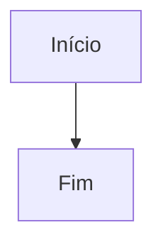
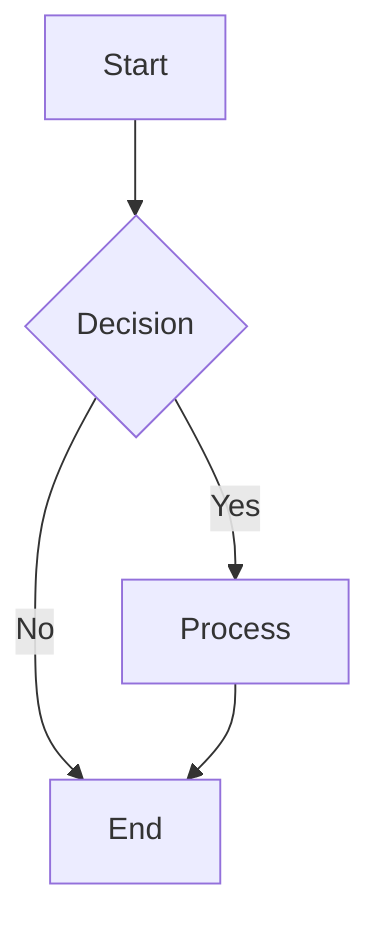
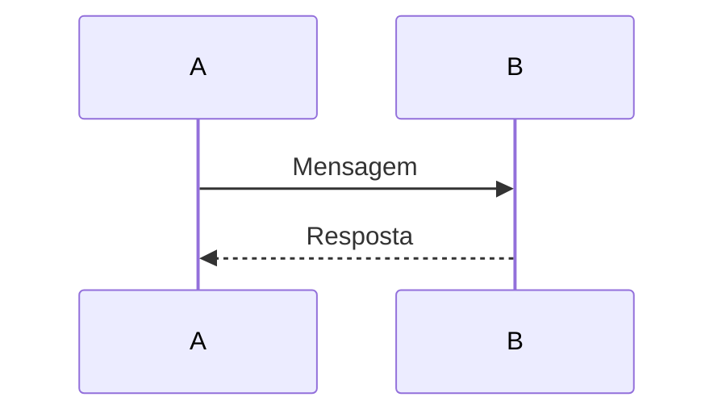
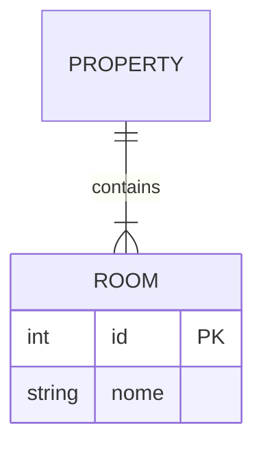
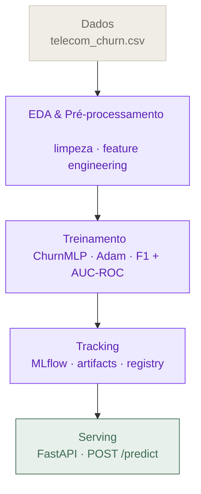
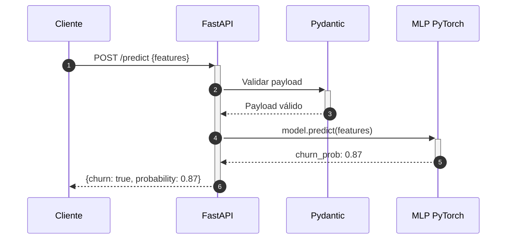
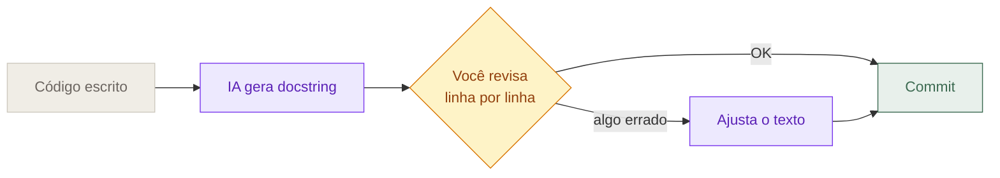

# Documentação em ML: do Model Card ao Tech Challenge

--- 

         Capítulo 01         
# Por que documentação é tão importante quanto o *modelo*
          
>            "O modelo está com 94% de acurácia. A API está no ar. O MLflow está logando tudo. Falta só escrever um README rapidinho."                   

Se você já pensou alguma variação dessa frase, este capítulo é para você. E talvez você não goste muito do que vem a seguir.                             
## 1.1 O custo invisível de não documentar
          

Em novembro de 2021, a Zillow, uma das maiores plataformas imobiliárias dos Estados Unidos, anunciou o **encerramento do Zillow Offers**, seu programa de iBuying baseado em Machine Learning. O modelo previa o preço de revenda de imóveis e decidia, de forma quase autônoma, quais casas comprar e por quanto. Em três meses, a empresa amargou prejuízos de cerca de **US$ 881 milhões**, demitiu **25% da força de trabalho** (aproximadamente 2.000 pessoas) e viu sua ação cair mais de 50%. Cerca de **7.000 imóveis** haviam sido comprados acima do valor de mercado.          

A história costuma ser contada como uma "falha de modelo". Mas é mais que isso: foi uma falha de **documentação**. Não havia registro claro de em que distribuição de mercado o modelo tinha sido treinado (uma fase fortemente ascendente), não havia critério documentado de quando retreinar em resposta a *drift*, e não havia comunicação estruturada entre cientistas de dados e tomadores de decisão sobre os limites do sistema. O modelo continuou tomando decisões enquanto a base de realidade mudava embaixo dele, e ninguém tinha um documento que dissesse "aqui é onde paramos de confiar".          

> **DEFINITION**  
>            

> **DEFINITION**  
>            

**Documentação, em ML, é o conjunto de artefatos textuais que tornam um sistema interpretável, reproduzível e auditável por outros humanos (incluindo você mesmo no futuro).** Inclui READMEs, Model Cards, Datasheets, runbooks, ADRs (Architecture Decision Records) e planos de monitoramento. Não é um anexo do projeto. É *parte* do projeto.                   

Este capítulo tem um único objetivo: convencer você de que documentação não é o **enfeite final** do Tech Challenge, e sim um **entregável técnico de primeira classe**, no mesmo nível do `train.py`, do `Dockerfile` e do endpoint do FastAPI. No critério de avaliação do seu Tech Challenge, "Documentação e Model Card" vale **10% da nota**, mas o argumento aqui é mais profundo do que pontuação: documentação é o que separa um experimento bonito de um sistema de ML em produção.                             
## 1.2 "Funciona na minha máquina": o pecado original
          

Todo engenheiro de ML já viveu (ou cometeu) a cena. O notebook gera um gráfico lindo, o modelo bate a baseline, o stakeholder aprova. Três meses depois alguém pergunta: *"que features você usou mesmo?"*, *"esse 0.94 era F1 ou acurácia?"*, *"qual versão do PyTorch?"*. E ninguém sabe responder.          

Sculley et al., em 2015, escreveram um dos papers mais citados de MLOps, *Hidden Technical Debt in Machine Learning Systems*, com a frase que virou mantra:          
>            

*"Only a small fraction of real-world ML systems is composed of the ML code."*                   

Ao redor do código de treino, há um oceano de configuração, infraestrutura, monitoramento, ingestão de dados e — o que mais nos interessa aqui — **conhecimento tácito**. Esse conhecimento tácito é o que não está em lugar nenhum: está na cabeça de quem fez. E cabeças mudam de empresa, esquecem, ficam doentes, vão de férias.          

A análise da Liang et al. 2024 (Stanford/Hugging Face), que examinou cerca de 32 mil Model Cards no Hugging Face, traz números que deveriam doer:          
           
- Apenas **44,2%** dos modelos hospedados no HF têm Model Card de algum tipo.           
- Esses modelos com card concentram **90,5% do tráfego** de downloads. Ou seja: **quem documenta é quem é usado.**           
- Mesmo entre os que têm card, a seção *Limitations* aparece em só **17,4%** dos casos.           
- *Evaluation* aparece em **15,4%**.           
- *Environmental Impact* em **2,0%**.           
- Quando os pesquisadores adicionaram Model Cards a 42 modelos previamente sem documentação, os downloads semanais cresceram **+29%**.                   

Traduzindo: a maior parte da comunidade de ML libera modelos no mundo sem dizer **o que eles fazem, em que dados foram treinados, e onde eles falham**. E quando alguém finalmente documenta, o impacto é mensurável em adoção.          

> **WARNING**  
>            

> **WARNING**  
>            

Se você está pensando "mas isso é problema de modelos públicos, no meu trabalho é diferente", lembre-se: o "outro" mais importante que vai ler sua documentação é **você mesmo daqui a seis meses**. E ele não vai ter acesso à sua memória de hoje.                                      
## 1.3 Documentação como infraestrutura cognitiva
          

Uma analogia útil: pense na documentação como **uma carta para o seu eu futuro**. Não para o você de amanhã (esse ainda lembra de tudo), mas para o você de seis meses à frente — depois de outro projeto, outras prioridades, outras stacks. Esse "eu futuro" abre o repositório, lê o código e tenta reconstruir o raciocínio. Tudo o que não estiver escrito vira arqueologia.          

Mais ainda: documentação é **infraestrutura cognitiva**. Assim como você não rodaria seu modelo sem um cluster, sem um banco e sem rede, ninguém deveria operar um sistema de ML sem o substrato textual que torna esse sistema **legível**. Sem documentação, todo o conhecimento sobre o sistema mora em pessoas, e pessoas são um single point of failure horrível.          

Na pesquisa da ZenML de dezembro de 2025, que analisou **1.200 deployments de LLM** em produção, a conclusão foi clara: **engenharia de software (não a sofisticação do modelo) é o principal preditor de sucesso**. Deployments que falham raramente falham porque o modelo era ruim — falham porque ninguém sabe onde está o quê, quem é responsável pelo retreino, e qual é o critério de rollback.                             
## 1.4 Quando a falta de documentação vira manchete
          

A história da Zillow não é exceção. É padrão. Vamos passar por seis casos em que sistemas de ML causaram dano real, financeiro ou reputacional, e em todos eles a **ausência de documentação adequada** (sobre dados, sobre limites, sobre uso pretendido) é parte central da causa raiz.                                                        Interativo · Timeline de incidentes ML                      
#### Seis manchetes, seis falhas de documentação
           

             Clique em um marco para ver o que aconteceu e qual artefato de documentação teria mitigado o caso.                                                                                                                                                                                                                                                                                 Selecione um marco da timeline para explorar o caso.                                                                                                                                                                               

> **WARNING**  
>                          

> **WARNING**  
>  O que aconteceu                         

                                               

> **EXAMPLE**  
>                          

> **EXAMPLE**  
>  O que documentação teria evitado                         

                                                                        Fonte:                                                                                                                                                    

Note o padrão. Em todos os casos, a falha técnica era visível em algum nível — viés no dataset, comportamento OOD, escopo mal definido. O que faltou não foi modelagem mais inteligente; faltou um **lugar onde alguém tivesse escrito**: "este sistema foi treinado em X, funciona dentro do envelope Y, e falha em Z". Documentação é o pre-requisito para que limitações sejam **discutíveis** em vez de invisíveis.                             
## 1.5 Os três públicos da sua documentação
          

Quando você escreve documentação de ML, você escreve simultaneamente para **três audiências distintas**, e tratar todas como uma só é o erro mais comum.          

> **DEFINITION**  
>            

> **DEFINITION**  
>            

**ADR (Architecture Decision Record).** Documento curto (≈1 página) que registra uma decisão técnica significativa, junto com o contexto que a motivou e as alternativas consideradas. Foi popularizado por Michael Nygard em 2011 e hoje é prática comum em times de engenharia. Exemplo: *"ADR-002: escolhemos MLP de 3 camadas em vez de XGBoost porque o time precisa servir o modelo com TorchScript no edge."*                                                        Audiência 1             
#### Você do futuro
             

Em seis meses, você não vai lembrar por que escolheu `lr=3e-4` em vez de `1e-3`. Não vai lembrar se `tenure_months` usou `StandardScaler` ou `MinMaxScaler`. Não vai lembrar por que removeu clientes com `monthly_charges > 8000` do treino.                            **Foco**               Decisões e seus porquês — ADRs curtos, seção "Notas de implementação" no README, comentários de "porquê" (não de "o quê") no código.                        

--- 

         Capítulo 02         
# Model Cards: documentando modelos com *responsabilidade*
          
>            "Se um capacitor vem com datasheet de voltagem, temperatura e modos de falha, por que um modelo de ML chegaria em produção sem?"                   

O Model Card é a "bula" do modelo: descreve para que foi feito, em que dados foi treinado, onde funciona bem e — principalmente — onde não deve ser usado. É o artefato que transforma um arquivo `.pth` anônimo em um sistema auditável.                             
## 2.1 Por que Model Cards existem
          

Imagine que você lança um classificador de risco de crédito e, seis meses depois, descobre que ele rejeita sistematicamente clientes acima de 60 anos em uma região específica do país. Pior: o time de produto não sabia que o modelo havia sido treinado apenas com dados de clientes urbanos da região Sudeste. Esse vazio entre **o que o modelo é** e **o que as pessoas pensam que ele é** é exatamente o problema que **Model Cards** vieram resolver.          

O conceito foi formalizado em janeiro de 2019, no paper *"Model Cards for Model Reporting"*, apresentado na FAT* '19 (Conference on Fairness, Accountability, and Transparency) em Atlanta. Os autores — entre eles Margaret Mitchell, Timnit Gebru e Inioluwa Deborah Raji — escreveram, no abstract:          
>            

*"Trained machine learning models are increasingly used to perform high-impact tasks in areas such as law enforcement, medicine, education, and employment. In order to clarify the intended use cases of machine learning models and minimize their usage in contexts for which they are not well suited, we recommend that released models be accompanied by documentation detailing their performance characteristics. In this paper, we propose a framework that we call model cards, to encourage such transparent model reporting."*           

— Mitchell et al., 2019 (arXiv:1810.03993)                   

Note as duas palavras-chave: **clarify** e **minimize**. Um Model Card não é um manual técnico exaustivo nem um relatório de auditoria. É um documento curto e estruturado que faz duas coisas:          
           
1. **Esclarece** os contextos para os quais o modelo foi projetado e validado.           
1. **Minimiza** o uso indevido em contextos onde ele não foi testado.                   

> **DEFINITION**  
>            

> **DEFINITION**  
>            

**Model Card.** Documento curto (1-5 páginas, na proposta original) que acompanha um modelo de ML treinado e descreve seu contexto de desenvolvimento, dados de treinamento e avaliação, métricas desagregadas por subgrupos relevantes, considerações éticas e limitações conhecidas. É a "bula" do modelo.                   

A inspiração do nome é deliberada: assim como **datasheets de componentes eletrônicos** descrevem voltagem, temperatura de operação, tolerâncias e modos de falha de um capacitor, Model Cards descrevem condições de operação de um modelo. Você não usaria um capacitor de 5V em um circuito de 24V sem ler o datasheet — por que usaria um modelo de detecção facial treinado em CelebA para identificar suspeitos em câmeras de segurança?          
### O problema antes dos Model Cards
          

Antes de 2019, a documentação de modelos era essencialmente:         
           
- Um arquivo `README.md` com o comando de treino.           
- Métricas agregadas (acurácia média, F1) em uma tabela do paper.           
- Talvez uma seção "Limitations" no final, com uma frase genérica.                   

Modelos eram avaliados como entidades monolíticas: *"o classificador tem 92% de acurácia"*. Mas 92% em quê? Em qual subgrupo? Com qual threshold? Com qual incerteza? Para qual aplicação? Sem essas respostas, o modelo virava uma caixa-preta — não no sentido técnico de interpretabilidade, mas no sentido **organizacional**: ninguém sabia explicar o que o modelo fazia bem ou mal.          

O Model Card resolve isso impondo uma estrutura mínima e forçando o autor a desagregar resultados.                             
## 2.2 As 9 seções canônicas
          

O framework original define **9 seções**. Não é um checklist burocrático: cada seção responde a uma pergunta específica que stakeholders (eng. de produto, jurídico, compliance, usuários finais) precisarão responder em algum momento. Clique em cada card abaixo para ver a descrição, perguntas-guia e um exemplo real de Model Cards publicados (BERT, Whisper, GPT-2, Smiling Face Detection, Perspective API).                               Interativo · Anatomia do Model Card           
#### Explore as 9 seções canônicas
           

Clique em qualquer seção para ver sua descrição, perguntas-guia e um exemplo real extraído de um Model Card publicado.                                                                            **                                                                                                                                                                                              Clique em uma seção para explorar                                                                                                                                            

                    Perguntas-guia                   
                                            
-                                                             Exemplo real                                                                                    Fonte:                                                                                                                                       

> **TIP**  
>            

> **TIP**  
>  Dica para o Tech Challenge           

Na seção **Metrics**, não reporte uma métrica única. Mostre **AUC-ROC**, **AUC-PR** (mais honesto quando as classes são desbalanceadas), **F1 no threshold operacional** e em pelo menos dois thresholds alternativos (ex.: 0,3 para priorizar sensibilidade; 0,7 para priorizar precisão). Sempre com intervalo de confiança de 95% calculado via bootstrap.                   

> **WARNING**  
>            

> **WARNING**  
>            

A seção *Caveats and Recommendations* não é um espaço para "se proteger juridicamente". É um espaço para ser **honesto**. Um card que diz *"o modelo não foi avaliado em clientes com tenure < 6 meses"* é mais útil — e mais defensável — que um que diz *"o modelo é apenas uma ferramenta de apoio à decisão"*.                                      
## 2.3 Exemplos reais para estudar
          

Antes de escrever o seu próprio Model Card, abra dois ou três destes e leia como os times resolveram cada seção. Os dois primeiros são **modelos tabulares** (o tipo do Tech Challenge); os demais são LLMs/visão que servem como referência de profundidade.          
### Bank Customer Churn · GradientBoostingClassifier
         

O caso mais próximo do seu Tech Challenge: churn bancário com modelo tabular, publicado no HuggingFace Hub. Traz **Deployment Tiers** com três thresholds operacionais explícitos (0,25 triagem ampla · 0,50 balanceado · 0,75 ação direta), análise de fairness por gênero (*"Female customers show 25% churn vs. males at 16% — fairness review recommended"*), Feature Importance documentada e comparação com quatro baselines. Use como template direto.          
### Keras Fraud Detection · MLP desbalanceado
         

Caso clássico de classe extremamente desbalanceada (*"fraudulent transactions represent only 0.18% of the dataset"*). O card prioriza **Recall** e reporta a matriz de confusão completa (TP/FN/FP/TN separadamente), permitindo ao leitor calcular qualquer métrica derivada. É o que você deveria fazer no churn: não só F1.          
### GPT-2 · OpenAI (2019)
         

Um dos primeiros Model Cards formais de LLM. A seção *Out-of-Scope* é memorável: já em 2019, antes do hype, a OpenAI documentou que *"modelos de linguagem como GPT-2 não distinguem fatos de ficção"*. É a seção mais subutilizada em cards reais e onde mora a maior proteção contra uso indevido.          
### BERT base uncased · Google / HuggingFace
         

Mais de 60 milhões de downloads por mês. Documenta o dataset (BookCorpus + Wikipedia) e admite explicitamente: *"Even if the training data used for this model could be characterized as fairly neutral, this model can have biased predictions."* Esse é o tipo de honestidade que separa um card responsável de um marketing material.          
### Whisper · OpenAI
         

Card detalhado, 6 arquiteturas (39M até 1,55B parâmetros), 98 idiomas. Documenta limitações concretas — alucinações, viés de sotaque, geração repetitiva — e antecipa uso em vigilância como risco ético. Serve de resposta pronta quando alguém pergunta *"posso usar Whisper para transcrever depoimentos jurídicos?"*.          

> **TIP**  
>            

> **TIP**  
>            

Copie a ideia de **Deployment Tiers** do card do Bank Churn para o seu Tech Challenge. Em vez de fixar o default `0.5`, exponha três thresholds com casos de uso diferentes — sua API pode até aceitar isso como parâmetro: `POST /predict?tier=triagem`.                                      
## 2.4 Adaptando o Model Card ao seu MLP tabular
          

Aqui está o ponto que vai diferenciar a sua entrega no Tech Challenge: **um Model Card genérico aplicado a um MLP tabular fica vazio**. Você precisa **enfatizar** as seções relevantes para tabular e **reduzir** as irrelevantes.          
### Seções que você DEVE enfatizar
         

| Seção | O que é | Por que importa no churn | |
| --- | --- | --- | --- |
| **Importância das features** | Qual feature mais influenciou as previsões (via SHAP ou análise de pesos). | Substitui o conceito de "atenção" de LLMs e mostra o que o modelo realmente aprendeu. | |
| **Sensibilidade ao threshold** | Como F1, Precision e Recall mudam em diferentes cortes (ex.: 0,3 · 0,5 · 0,7). | Churn é binário com custos assimétricos — uma só métrica em um só corte esconde o comportamento real do modelo. | |
| **Calibração das probabilidades** | Se o modelo diz "80% de chance de churn", isso realmente bate com 80% de churn na prática? Quando não bate, o modelo está "descalibrado". | Se a área de negócio vai agir com base na probabilidade (ex.: desconto para quem tem >70% de risco), ela precisa ser confiável. | |
| **Fairness por subgrupo** | Métricas desagregadas por idade, gênero, região — o modelo erra mais em algum grupo? | Dois clientes com o mesmo perfil técnico não deveriam receber tratamentos diferentes por causa de demografia. | |
| **Drift das features** | Medida de quanto a distribuição dos dados em produção mudou em relação ao treino. | Se mudar muito, o modelo perde validade e precisa ser retreinado antes de tomar decisões ruins em silêncio. | |
| **Custo assimétrico** | Matriz de custo do negócio: quanto vale um falso negativo (cliente perdido) versus um falso positivo (retenção desnecessária)? | É o que traduz a escolha de threshold em R$ e permite defender a decisão junto a stakeholders. | |          
### Seções que você pode REDUZIR ou OMITIR
         

São seções típicas de cards de LLM ou visão que não fazem sentido para um classificador tabular:         

| Seção | Por que não se aplica | |
| --- | --- | --- |
| Toxicity / conteúdo ofensivo | Não há geração de texto. | |
| Resistência a jailbreak | Não há instruções a burlar — só features numéricas de entrada. | |
| Alucinação | O modelo não gera; só classifica. | |
| Seguir instruções | O input não é texto livre. | |
| Suporte multilíngue | Features são numéricas e categóricas. | |
| Tamanho de contexto | O input é um vetor de features de tamanho fixo. | |          

> **WARNING**  
>            

> **WARNING**  
>            

**Atenção: NÃO copie um template de Model Card de LLM e deixe seções vazias.** Um card com 8 seções vazias e 2 preenchidas comunica desleixo. Melhor entregar 6 seções **profundas e específicas para tabular** do que 14 seções superficiais.                                      
## 2.5 De Model Cards a System Cards: a evolução 2019 → 2026
          

O paper original de Mitchell et al. (2019) definiu Model Cards como documentos de **1 a 5 páginas**. Em 2026, o **System Card do Claude Opus 4.7**, publicado em 16 de abril de 2026, tem **232 páginas** (anthropic.com/claude-opus-4-7-system-card). O que mudou?          
### O que mudou (e por quê)
         

Modelos de fronteira deixaram de ser apenas *classificadores* para se tornarem **agentes capazes de executar ações no mundo** — escrever código, navegar na web, operar computadores, ajudar em pesquisa biológica. Cada nova capacidade trouxe novos riscos, e cada novo risco trouxe novas seções no card. Para se ter uma ideia da escala: o System Card do Claude Opus 4.7 tem 232 páginas.          
### Dimensões que surgiram a partir de 2023
         

A tabela abaixo lista as seções novas que aparecem em System Cards modernos (Anthropic, OpenAI, Google DeepMind, Meta) e que **não existiam** no Model Card original de 2019. Cada linha traz o que significa e por que virou obrigatória.         

| Dimensão | O que é | |
| --- | --- | --- |
| **Red teaming** | Equipes adversariais (internas e externas) tentando provocar o modelo a fazer algo perigoso antes do lançamento. O card do GPT-5 reporta "5.000+ horas, 400+ especialistas". | |
| **Risco CBRN**  
(químico, biológico, radiológico, nuclear) | Avalia se o modelo pode dar uplift significativo a alguém querendo construir uma arma. Traz thresholds formais: ASL-3/4 (Anthropic), High/Critical (OpenAI), CCL (Google). | |
| **Avaliações agênticas** | Testes de modelos agindo como agentes: escrever código, executar ferramentas, operar um computador. Benchmarks como ART e multi-agent orchestration entram aqui. | |
| --- | --- | --- |
| **RSP / Preparedness** | Responsible Scaling Policy / Preparedness Framework: políticas formais que definem*sob que condições*o modelo pode ser lançado. Transformam "o modelo é seguro?" em "o modelo atende às regras X, Y, Z?". | |
| **Elicitação de capacidades** | Esforço estruturado para extrair o máximo do modelo durante a avaliação — uplift trials com especialistas, prompts especializados — para não subestimar o risco real. | |
| **Sandbagging / consciência de avaliação** | Investigação se o modelo*percebe*que está sendo testado e, percebendo, se esconde capacidades ("sandbagging") para passar na avaliação. Relevante para modelos com raciocínio em cadeia. | |
| **Monitoramento de deception** | Medição de com que frequência o modelo mente ou engana no próprio raciocínio (chain-of-thought monitoring). Reportado como taxa por modelo. | |
| **Bem-estar do modelo** | Consideração inicial, mas já formal, sobre estados internos do modelo — ex.: "incapacidade de encerrar conversas" listada como preocupação no card do Claude Opus. | |
| **Resistência a jailbreak** | Medidas de como o modelo resiste a tentativas de contornar restrições, em single-turn e multi-turn (StrongReject, HarmBench, etc.). | |          

**Tendências macro:**         
           
- Cards de **232 páginas** vs 1-2 páginas originais.           
- Cards **específicos por feature** (ChatGPT Agent, Deep Research) e não só por modelo.           
- **Cadência de addenda**: GPT-5.1, GPT-5.2, GPT-5.3-Codex, etc.                   

> **TIP**  
>            

> **TIP**  
>            

**Para o Tech Challenge:** você obviamente não vai escrever 232 páginas. Mas a **estrutura mental** dos System Cards modernos é útil — pense no seu MLP de churn como parte de um **sistema** (modelo + threshold + lógica de negócio + monitoramento + plano de retreino). O Model Card documenta o *modelo*; um *System Card* documentaria o sistema todo. Para uma entrega excelente, faça pelo menos **um esboço** dessa visão sistêmica.                                                  Interativo · Comparador Bom vs Ruim           
#### Model Card · Churn MLP v1.0.0 — duas versões do mesmo documento
           

O mesmo modelo, a mesma versão — mas com documentação preguiçosa ou completa. Alterne entre as versões e veja o contraste.                         Versão preguiçosa             Versão completa                                                              1. Model Details                                
                   
- Versão: [insert version]                   
- Data de treino: TODO: fill                   
- Arquitetura: MLP                   
- Licença: ?                   
- Contato: TODO                                                                         2. Intended Use               Prever churn de clientes.                                         3. Training Data               Dataset de churn [dataset name].                                         4. Metrics                                
                   
- F1: 0.78                   
- AUC: TBD                   
- Threshold: default                                                                         5. Fairness               Not evaluated.                                         6. Caveats               O modelo é apenas uma ferramenta de apoio à decisão.                                                                           1. Model Details                                
                   
- Versão: **1.0.0** (semver; next patch em caso de retreino sem mudança de schema)                   
- Data de treino: **2026-03-15**                   
- Arquitetura: MLP PyTorch 2.2 — camadas [N → 64 → 32 → 1], ativação ReLU, dropout 0.3                   
- Licença: MIT                   
- Contato: `grupo-XY@fiap.br`                                                                         2. Intended Use                                
                   
- **Primário:** estimar probabilidade de churn em horizonte de 30 dias para clientes ativos com tenure ≥ 3 meses.                   
- **Usuário-alvo:** time de retenção / CRM.                   
- **Out-of-scope:** clientes B2B; períodos de promoção atípica (Black Friday); uso para decisões de crédito ou cobrança; aplicação automática de penalidades sem revisão humana.                                                                         3. Training Data                                
                   
- Telco Customer Churn (Kaggle), 7.043 registros, período 2022-Q1 a 2023-Q4.                   
- Split **temporal**: treino = meses 1-9 · val = 10 · teste = 11-12.                   
- Distribuição: 26,5% positivos / 73,5% negativos (sem oversampling — usamos `class_weight`).                   
- Pré-processamento: imputação de mediana (numéricos), one-hot para cardinalidade ≤ 10, target encoding para alta cardinalidade.                                                                         4. Metrics                                
                   
- **F1 = 0,81** (IC95% 0,79-0,83 via bootstrap *n*=1000) @ threshold operacional 0,5.                   
- AUC-ROC = 0,87 · **AUC-PR = 0,72** (priorizado pelo desbalanceamento).                   
- Calibração: Brier = 0,14 · ECE = 0,03 · reliability diagram em anexo.                   
- Sensibilidade ao threshold: F1/Precision/Recall reportados também em 0,3 (triagem) e 0,7 (ação direta).                                                                         5. Fairness                                
                   
- Acurácia por gênero: 0,86 (M) vs 0,84 (F) — gap 2 pp.                   
- Acurácia por faixa etária: 0,88 (>50) vs 0,79 (<25) — gap 9 pp ⇒ **fairness review recomendado**.                   
- Demographic parity e equal opportunity calculados; recall em minoria dentro de 0,03 do grupo majoritário.                                                                         6. Caveats                                
                   
- Modelo **não foi avaliado** em períodos de promoção atípica (ex: Black Friday).                   
- Retreinar a cada 3 meses *ou* quando PSI > 0,25 em qualquer feature top-5.                   
- Probabilidades podem descalibrar após mudança de mix de produtos — revisar Brier/ECE no monitor mensal.                   
- Threshold operacional deve ser revisitado se a matriz de custos (FN vs FP) do negócio mudar.                                                                                 6 diferenças críticas que separam um card raso de um card profissional             
               
1. Métricas reportadas com IC95% via bootstrap (n=1000)               
1. Fairness desagregada por gênero e faixa etária               
1. Threshold operacional justificado pelo custo de FN               
1. Out-of-scope cases explicitados (B2B, promoção atípica)               
1. Calibração documentada (Brier, ECE)               
1. Data de treino e split temporal explícitos                                                                       
## 2.6 Aplicação ao Tech Challenge: esqueleto do Model Card do MLP de churn
          

Você vai detalhar este card no **Capítulo 6**. Aqui é apenas o **esqueleto**, com perguntas-guia específicas para o seu cenário.  

```markdown
---
language: pt
license: mit
library_name: pytorch
tags: [tabular-classification, churn, mlp, postech, fiap]
metrics: [f1, roc_auc, average_precision, brier_score]
---

# Model Card — Churn MLP (Pós-Tech FIAP)

## 1. Model Details
- Versão: 1.0.0
- Data de treino: AAAA-MM-DD
- Arquitetura: MLP PyTorch (camadas: [N → 64 → 32 → 1], ativ. ReLU, dropout 0.3)
- Treinado por: <seu nome / grupo>
- Licença: MIT
- Contato: <email>
- Citação BibTeX (opcional)

## 2. Intended Use
- Primário: estimar probabilidade de churn em horizonte de 30 dias para clientes ativos
  com tenure ≥ 3 meses.
- Usuário: time de retenção / CRM.
- Out-of-Scope:
  - Decisões de crédito ou cobrança.
  - Clientes com tenure < 3 meses.
  - Aplicação automática de penalidades sem revisão humana.

## 3. Factors
- Demográficos: faixa etária, gênero (quando disponível).
- Contratuais: tipo de contrato, método de pagamento.
- Temporais: mês da safra, sazonalidade.

## 4. Metrics
- AUC-ROC, AUC-PR (priorizar PR pelo desbalanceamento).
- F1 nos thresholds [0.3, 0.5, 0.7] com IC95% via bootstrap (n=1000).
- Brier Score e ECE para calibração.
- Reliability diagram em anexo.

## 5. Evaluation Data
- Dataset, split temporal (treino: meses 1-9; val: 10; teste: 11-12).
- Pré-processamento: imputação de mediana para numéricos, one-hot para categóricos
  com cardinalidade ≤ 10, target encoding para alta cardinalidade.

## 6. Training Data
- Mesmo dataset, mesma transformação. Documentar oversampling/undersampling se aplicado.
- Distribuição de classes: positiva ≈ X%, negativa ≈ Y%.

## 7. Quantitative Analyses
- Métricas desagregadas por: faixa etária (5 bins), gênero, região, tipo de contrato.
- Reportar gap entre o melhor e o pior subgrupo.

## 8. Ethical Considerations
- Não usar gênero como feature direta se houver alternativa.
- Mitigação de fairness: reweighting por subgrupo testado.
- Riscos: ações de retenção mal direcionadas podem gerar percepção de discriminação.

## 9. Caveats and Recommendations
- Modelo não foi avaliado em períodos de promoção atípica (ex: Black Friday).
- Re-treino recomendado a cada 3 meses ou quando PSI > 0.25 em qualquer feature top-5.
- Threshold operacional deve ser revisitado se a matriz de custos do negócio mudar.

```
          

> **TIP**  
>            

> **TIP**  
>            

**Dica de produtividade.** Comece o card **antes** de treinar o modelo. As seções 1, 2, 3, 5, 6 podem ser escritas com base no design do experimento — só as seções 4, 7, 8, 9 dependem dos resultados. Escrever cedo evita o anti-padrão "Model Card escrito 3 horas antes da entrega".                                   

--- 

         Capítulo 3         
# README + Mermaid: a porta de entrada no *GitHub*
          
>            "Você tem 30 segundos. É o tempo médio que um recrutador, um colega de trabalho ou um avaliador da FIAP gasta no seu README antes de decidir se vale a pena clonar o repositório. Faça-os contar."                            
## 3.1 Por que o README é a peça mais importante do projeto
          

Imagine duas situações que acontecem todos os dias no GitHub:          

**Cenário A.** Uma engenheira de ML de uma fintech procura referências de pipelines de churn em PyTorch. Ela encontra seu repositório, abre o README, vê um título genérico, três linhas explicando "projeto de TCC", nenhum diagrama, nenhuma instrução de instalação. Fecha a aba.          

**Cenário B.** A mesma engenheira encontra outro repositório. Logo no topo, badges verdes mostram que o build está passando, a cobertura de testes está em 87%, o modelo tem licença MIT. Abaixo, um diagrama Mermaid mostra o pipeline completo: dados → EDA → treinamento → MLflow → FastAPI. Em seguida, um bloco `bash` com cinco comandos que sobem o serviço localmente. Ela clona, roda, testa em dez minutos, e marca o repositório com uma estrela.          

A diferença entre esses dois cenários não é a qualidade do código. É a qualidade do README.          

> **DEFINITION**  
>            

> **DEFINITION**  
>            

**Definição operacional.** Um README funciona bem quando outra pessoa consegue instalar, executar e entender o que seu projeto faz **sem precisar te chamar**. Esse é o teste prático. Se um colega precisa abrir uma issue ou mandar mensagem perguntando "como rodo?", provavelmente falta alguma coisa no README.                   

Para o Tech Challenge da Pós-Tech, o README cumpre três papéis simultâneos:          
           
1. **Cartão de visitas profissional.** Recrutadores leem READMEs antes de leerem currículos.           
1. **Documentação técnica de avaliação.** Os professores precisam reproduzir seu trabalho.           
1. **Memória externa do projeto.** Você mesmo, daqui a três meses, vai esquecer onde colocou o script de pré-processamento.                   

Este capítulo te dá o esqueleto canônico, mostra como projetos famosos resolveram (e em alguns casos, deixaram de resolver) esse problema, e ensina a usar Mermaid para transformar fluxogramas em diagramas versionáveis nativos do GitHub.                             
## 3.2 Anatomia padrão de um README moderno
          

A maioria dos READMEs de projetos de ML combina um subconjunto dessas **13 seções**. A ordem importa: quem chega no GitHub lê de cima para baixo e desiste rápido — coloque o que segura o leitor primeiro.          
### As 13 seções, na ordem
         

A ordem e a presença de cada seção variam por projeto. A tabela indica o quão frequente cada uma costuma aparecer em READMEs do ecossistema Python/ML:          

| # | Seção | Costuma aparecer | Por que ajuda | |
| --- | --- | --- | --- | --- |
| 1 | Título + logo | Quase sempre | Identidade visual imediata | |
| 2 | Tagline curta | Quase sempre | Em uma frase: o que é? | |
| 3 | Badges | Comum | Sinais de qualidade verificáveis | |
| 4 | Screenshot/GIF demo | Depende | Vale mil linhas de descrição | |
| 5 | Instalação | Quase sempre | Sem isso, ninguém roda | |
| 6 | Quickstart (5–15 linhas) | Quase sempre | "Hello world" funcional | |
| 7 | Features | Comum | Por que escolher esse projeto? | |
| 8 | Exemplos | Comum | Casos de uso reais | |
| 9 | Documentação (link) | Projetos grandes | Para quem quer aprofundar | |
| 10 | Estrutura do repo | Comum | Mapa mental do código | |
| 11 | Contribuição | Open source | Como participar | |
| 12 | Citação (BibTeX) | Projetos acadêmicos | Crédito reproduzível | |
| 13 | Licença | Quase sempre | Sem licença, o projeto não pode ser reutilizado com segurança | |          
### Convenções modernas (2024–2025)
          

A escrita de READMEs evoluiu. As práticas atuais são:          
           
- **Mermaid nativo no GitHub** (suportado desde fevereiro de 2022) — diagramas versionáveis em texto.           
- **GitHub Alerts** com a sintaxe `[!NOTE]`, `[!WARNING]`, `[!TIP]`, `[!IMPORTANT]`, `[!CAUTION]` — boxes nativos sem precisar de HTML.           
- **Tabelas de benchmark/performance** — números falam mais que adjetivos.           
- **Links âncora internos** (`[Instalação](#instalação)`) para navegação rápida.           
- **Badges via shields.io** com estilo `flat-square` (mais limpo que `for-the-badge`).                   

> **TIP**  
>            

> **TIP**  
>            

Use os GitHub Alerts em vez de criar boxes em HTML. Eles renderizam de forma consistente em qualquer cliente do GitHub (web, mobile, integrações), respeitam dark mode e são acessíveis para leitores de tela.                   
### Exemplo da sintaxe de GitHub Alerts
  

```markdown
> [!NOTE]
> Útil para informações que o leitor deveria saber, mesmo sem ser crítico.

> [!TIP]
> Conselhos opcionais que melhoram a experiência.

> [!IMPORTANT]
> Informação essencial para entender o projeto.

> [!WARNING]
> Conteúdo crítico que demanda atenção imediata.

> [!CAUTION]
> Consequências negativas potenciais de uma ação.
```
                             
## 3.3 Análise comentada de READMEs famosos
          

A melhor forma de aprender a escrever um README é ler os que funcionam (e os que não funcionam). Selecionamos quatro projetos de referência do ecossistema Python/ML, mais um bônus, e dissecamos cada um.          
### 3.3.1 scikit-learn — minimalista RST
          

**URL:** https://github.com/scikit-learn/scikit-learn/blob/main/README.rst          

**Formato:** reStructuredText (`.rst`), não Markdown. Tradição da comunidade Python científica (a docs do CPython também usa RST).          

**Tamanho:** ~450 linhas.          

**Trecho literal:**          
>            

*"scikit-learn is a Python module for machine learning built on top of SciPy and is distributed under the 3-Clause BSD license."*           

*"The project was started in 2007 by David Cournapeau as a Google Summer of Code project."*                   

**Estrutura:**          
           
1. Título e tagline em uma linha           
1. Bloco massivo de badges (GitHub Actions, Codecov, CircleCI, Nightly wheels, Ruff, Python Version, PyPI, **DOI**, Benchmark)           
1. Seção "Important links" centralizando navegação           
1. Instalação via `pip` e `conda`           
1. Dependências e versões mínimas           
1. Changelog           
1. Desenvolvimento e contribuição           
1. Comunicação e suporte           
1. Citação acadêmica                   

**Pontos fortes:**          

| Ponto | Por que importa | |
| --- | --- | --- |
| Badge**DOI** | Sinaliza projeto citável academicamente — essencial para reprodutibilidade | |
| Seção "Important links" | Reduz tempo do leitor para achar o que importa | |
| Tabela de versões mínimas | Evita milhares de issues de "não funciona aqui" | |          

**Fraquezas:**          
           
- **Zero quickstart com código.** Quem nunca usou scikit-learn precisa sair do README e ir para a docs externa para ver `from sklearn.linear_model import LogisticRegression`.           
- **Sem Mermaid, sem screenshots, sem GIFs.** É funcional, mas frio.                             
### 3.3.2 PyTorch — 2.800 linhas e uma tabela de instalação heroica
          

**URL:** https://github.com/pytorch/pytorch/blob/main/README.md          

**Formato:** Markdown.          

**Tamanho:** **~2.800 linhas** — provavelmente o maior README de projeto Python que você verá.          

**Trechos literais:**          
>            

*"PyTorch is a Python package that provides two high-level features: Tensor computation (like NumPy) with strong GPU acceleration"*           

*"we use a technique called reverse-mode auto-differentiation, which allows you to change the way your network behaves arbitrarily with zero lag or overhead"*                   

**Estrutura:**          
           
1. Logo + GIF dinâmico mostrando autograd           
1. Justificativa filosófica (por que PyTorch existe)           
1. Componentes (`torch`, `torch.nn`, `torch.autograd`, `torch.utils`, etc.)           
1. **Tabela HTML gigante** de instalação cobrindo Linux × macOS × Windows × CUDA versions × pip/conda           
1. Construção from source           
1. Docker           
1. Contribuição                   

**Pontos fortes:**          

| Ponto | Por que importa | |
| --- | --- | --- |
| Tabela de instalação por plataforma | PyTorch suporta dezenas de combinações de CUDA — a tabela elimina dúvidas | |
| Justifica decisões de design | Explica POR QUE escolheu reverse-mode autodiff. Educa o leitor. | |
| GIF mostrando autograd | Mostra o "wow" do produto em 5 segundos | |          

**Fraquezas:**          
           
- **Nenhum quickstart de treino.** Para 2.800 linhas, é estranho não ter um exemplo `model = nn.Linear(10, 1); ...; loss.backward()`.           
- Tamanho intimida. Quem chega pela primeira vez não sabe por onde começar.                             
### 3.3.3 FastAPI — referência de marketing técnico
          

**URL:** https://github.com/fastapi/fastapi/blob/master/README.md          

**Tamanho:** ~850 linhas.          

O README do FastAPI é uma boa referência para ver como um projeto Python combina documentação técnica com comunicação de produto (testimonials, screenshots, quickstart copiável).          

**Trecho literal — tagline:**          
>            

*"FastAPI framework, high performance, easy to learn, fast to code, ready for production"*                   

**Trecho literal — testimonial:**          
>            

*"I'm using FastAPI a ton these days. […] I'm actually planning to use it for all of my team's ML services at Microsoft"* — Kabir Khan, Microsoft                   

**Estrutura:**          
           
1. Logo, tagline em uma linha           
1. Badges (CI, coverage, PyPI, Python versions)           
1. **Bloco de testimonials** com aspas reais de engenheiros de Microsoft, Uber, Netflix           
1. Logo grid de **sponsors** (mostra capital social do projeto)           
1. **Quickstart funcional** logo após instalação — você cola e roda           
1. Lista de features com **emojis nos bullets** (⚡, 🚀, 🐛, ✏️) — escaneável           
1. Três **screenshots do Swagger UI** auto-gerado           
1. Dois **screenshots do ReDoc**           
1. Screenshot do VS Code mostrando autocomplete — vende tipagem visualmente           
1. Thumbnail de vídeo no YouTube (link para palestra)                   

**Pontos fortes:**          

| Ponto | Por que funciona | |
| --- | --- | --- |
| Testimonials de empresas conhecidas | Prova social acelera adoção | |
| Quickstart copiável | "Funciona em 30 segundos" — promessa cumprida | |
| Screenshots do Swagger | Mostra um diferencial que texto não vende | |
| Screenshot do VS Code | Vende a experiência de desenvolvimento, não só o runtime | |          

**Fraquezas:**          
           
- **Sem Mermaid.** O fluxo request → validation → handler → response poderia ser um diagrama incrível.           
- Tamanho às vezes excessivo — alguns testimonials redundantes.                   

> **TIP**  
>            

> **TIP**  
>            

Uma leitura do FastAPI: o README pode ser mais do que documentação técnica — também comunica o produto. Mostrar o que funciona (screenshots, quickstart copiável) costuma ter mais impacto do que só descrever.                             
### 3.3.4 MLflow — "AI Engineering Platform"
          

**URL:** https://github.com/mlflow/mlflow/blob/master/README.md          

**Tamanho:** ~1.200 linhas.          

**Trechos literais:**          
>            

*"MLflow is the largest open source AI engineering platform for agents, LLMs, and ML models"*           

*"with over 60 million monthly downloads, thousands of organizations rely on MLflow each day to ship AI to production with confidence"*                   

**Posicionamento atualizado:** repare que o MLflow não se vende mais como ferramenta de **MLOps** apenas. Agora é "AI Engineering Platform". Esse repositionamento é deliberado para abraçar a onda de LLMs e agents.          

**Estrutura:**          
           
1. Logo + tagline atualizada           
1. Badges + número de downloads (60M/mês — prova social numérica)           
1. **Quatro screenshots** lado a lado: Observability, Evaluation, Prompts & Optimization, AI Gateway           
1. Tabelas de logos de integrações (Hugging Face, OpenAI, Anthropic, etc.)           
1. Quickstart por componente (Tracking, Models, Registry)           
1. **Star History** via star-history.com — gráfico de crescimento                   

**Pontos fortes:**          

| Ponto | Por que importa | |
| --- | --- | --- |
| Número absoluto (60M downloads/mês) | Mais convincente que adjetivos | |
| Screenshots de cada produto | Mostra que a plataforma é multi-componente | |
| Star History | Mostra trajetória — projeto vivo, não estagnado | |          

**Fraquezas:**          
           
- Em alguns lugares mistura linguagem de produto com técnica — pode confundir desenvolvedor pragmático.           
- Sem diagrama de arquitetura no README (Mermaid resolveria).                             
### 3.3.5 Bônus — HuggingFace Transformers
          

**URL:** https://github.com/huggingface/transformers/blob/main/README.md          

**Tamanho:** ~450–500 linhas (uso pesado de **seções colapsáveis** mantém limpo).          

**Trecho literal:**          
>            

*"Transformers acts as the model-definition framework for state-of-the-art machine learning with text, computer vision, audio, video, and multimodal models"*                   

**Diferenciais técnicos do README:**          
           
- Logo com **suporte dark/light mode** (via `<picture>` HTML com `prefers-color-scheme`)           
- Sete badges           
- **`<details>` colapsáveis** — esconde listas longas (idiomas suportados, lista de modelos) sem poluir a leitura           
- Sem Mermaid                   

**Snippet do truque dark/light:**  

```markdown
<picture>
  <source media="(prefers-color-scheme: dark)" srcset="logo-dark.svg">
  <source media="(prefers-color-scheme: light)" srcset="logo-light.svg">
  
</picture>
```
          

**Snippet de seção colapsável:**  

```markdown
<details>
<summary>Lista completa de modelos suportados (clique para expandir)</summary>

- BERT
- GPT-2
- LLaMA
- ...
</details>
```
          
### Resumo comparativo
          

| Projeto | Linhas | Quickstart | Screenshots | Mermaid | Sponsors | DOI | |
| --- | --- | --- | --- | --- | --- | --- | --- |
| scikit-learn | ~450 | Não | Não | Não | Não | **Sim** | |
| PyTorch | ~2.800 | Não | GIF | Não | Não | Não | |
| FastAPI | ~850 | **Sim** | **5** | Não | **Sim** | Não | |
| MLflow | ~1.200 | Sim | **4** | Não | Não | Não | |
| Transformers | ~500 | Sim | Logo dark/light | Não | Não | Não | |          

> **DEFINITION**  
>            

> **DEFINITION**  
>  Insight           

**Insight:** nenhum dos cinco READMEs analisados usa Mermaid. O Mermaid é mais comum em **docs internos**, ADRs (Architecture Decision Records) e wikis de empresa do que em READMEs públicos de projetos famosos. Isso significa que **incluir um Mermaid no seu Tech Challenge te diferencia imediatamente** — você está aplicando uma prática moderna que projetos consolidados ainda não absorveram em seus READMEs principais.                                      
## 3.4 Badges — sinais visuais de qualidade
          

Badges são micro-imagens SVG que comunicam estado verificável: build passando, cobertura de testes, versão atual, licença, downloads. O shields.io é o serviço mais adotado pela comunidade.          
### Categorias disponíveis no shields.io
          

| Categoria | Exemplos para ML | |
| --- | --- | --- |
| Build | GitHub Actions, CircleCI | |
| Code Coverage | Codecov, Coveralls | |
| Version | PyPI version | |
| Downloads | PyPI downloads/month | |
| License | MIT, Apache-2.0, BSD-3 | |
| Platform | Python version | |
| Social | GitHub stars, followers | |
| Funding | Sponsors | |
| Test Results | Pytest | |
| Rating | DOI (acadêmico), Hugging Face | |          
### Estilos disponíveis
          

| Estilo | Quando usar | |
| --- | --- | --- |
| `flat` | Padrão, neutro | |
| `flat-square` | Muito usado — visual mais limpo e moderno | |
| `plastic` | Legacy, parece dos anos 2010 | |
| `for-the-badge` | Chamativo, ocupa muito espaço — evite | |
| `social` | Estilo do GitHub (estrelas, followers) | |          
### Sintaxe Markdown
  

```markdown


```
          

> **TIP**  
>            

> **TIP**  
>            

Para projetos de Tech Challenge, recomendamos: **Python version**, **License**, **Build status** (se você configurou CI), e opcionalmente **PyTorch version** e **MLflow version**. Quatro a seis badges é o ponto certo. Mais que isso vira poluição.                                      
## 3.5 Mermaid — diagramas que vivem dentro do Markdown
          
### 3.5.1 O que é Mermaid
          

Mermaid é uma biblioteca JavaScript que renderiza diagramas a partir de descrições em texto inspiradas em Markdown. Você escreve algo assim:  

```markdown

```
          

E o GitHub renderiza um diagrama de verdade na hora de exibir o arquivo.          
### 3.5.2 O anúncio que mudou o jogo (fev/2022)
          

Em 14 de fevereiro de 2022, o GitHub publicou o post oficial em https://github.blog/2022-02-14-include-diagrams-markdown-files-mermaid/ com a frase de marketing:          
>            

*"A picture tells a thousand words. Now you can quickly create and edit diagrams in markdown using words with Mermaid support"*                   

A partir desse dia, qualquer arquivo `.md` no GitHub renderiza blocos `mermaid` automaticamente, sem plugins, sem extensões, sem configuração.          

**Detalhes técnicos do suporte do GitHub:**          
           
- Renderização via **iframe** apontando para o subdomínio Viewscreen (isolamento de segurança).           
- Funciona **progressivamente** — o Markdown continua compatível mesmo sem JavaScript habilitado.           
- Isolamento de conteúdo evita XSS via diagramas maliciosos.                   
### 3.5.3 Tipos de diagrama (Mermaid v11.14.0)
          

A versão atual do Mermaid (v11.14.0, abril/2026) suporta uma lista impressionante de tipos:          

**Clássicos (estáveis):**          

| Tipo | Uso típico | |
| --- | --- | --- |
| Flowchart | Pipelines, fluxo de processo | |
| Sequence Diagram | Interação entre serviços/atores | |
| Class Diagram | Modelagem OO | |
| State Diagram | Máquinas de estado | |
| ER Diagram | Modelagem de dados | |
| User Journey | UX, jornada do usuário | |
| Gantt | Cronogramas | |
| Pie Chart | Distribuições simples | |
| Quadrant Chart | Matriz 2x2 (impacto x esforço) | |
| Requirement Diagram | Rastreabilidade de requisitos | |
| GitGraph | Branches do Git | |
| C4 Diagram | Arquitetura (modelo C4) | |
| Mindmap | Brainstorm | |
| Timeline | Linha do tempo histórica | |
| ZenUML | UML simplificado | |          

**Novos (2024–2025):**          

| Tipo | Uso típico | |
| --- | --- | --- |
| Sankey | Fluxo proporcional (energia, dados) | |
| XY Chart | Gráficos cartesianos básicos | |
| Block Diagram | Blocos arquiteturais | |
| Packet | Estrutura de pacotes de rede | |
| Kanban | Quadros de tarefas | |
| Architecture | Arquitetura de sistemas | |
| Radar | Comparação multi-dimensional | |
| Treemap | Hierarquia proporcional | |
| Venn | Interseção de conjuntos | |
| Ishikawa | Diagrama de causa-efeito | |
| TreeView | Árvores expandíveis | |          
### 3.5.4 Sintaxe verificada — Flowchart
          

O Flowchart é o tipo que você mais vai usar. Dominar ele resolve 80% dos casos.  

```markdown

```
          

**Direções suportadas:**          

| Sigla | Significado | |
| --- | --- | --- |
| `TD`ou`TB` | Top-Down / Top-Bottom | |
| `BT` | Bottom-Top | |
| `LR` | Left-Right | |
| `RL` | Right-Left | |          

**Formas de nó:**          

| Sintaxe | Forma | |
| --- | --- | --- |
| `A[texto]` | Retângulo | |
| `A(texto)` | Arredondado | |
| `A([texto])` | Estádio | |
| `A((texto))` | Círculo | |
| `A{texto}` | Losango (decisão) | |
| `A[(texto)]` | Cilindro (banco de dados) | |          

**Tipos de seta:**          

| Sintaxe | Resultado | |
| --- | --- | --- |
| `A --> B` | Seta sólida | |
| `A --- B` | Linha sólida sem seta | |
| `A -.-> B` | Seta tracejada | |
| `A ==> B` | Seta grossa | |
| `A -->|label| B` | Seta com texto | |          
### 3.5.5 Sintaxe verificada — sequenceDiagram
          

Ideal para mostrar interação entre componentes. No Tech Challenge, perfeito para descrever o fluxo de uma chamada à API.  

```markdown

```
          

**Tipos de participante:**          

`participant`, `actor`, `boundary`, `control`, `entity`, `database`, `collections`, `queue`.          

**Blocos lógicos:**          

`loop`, `alt`/`else`, `par`/`and`, `critical`/`option`, `break`, `rect`.          
### 3.5.6 Sintaxe verificada — erDiagram
          

Útil para modelagem de dados — por exemplo, descrever o schema da feature store ou a tabela de previsões persistidas.  

```markdown

```
          

**Cardinalidades:**          

| Símbolo | Significado | |
| --- | --- | --- |
| `|o` | Zero ou um | |
| `||` | Exatamente um | |
| `}o` | Zero ou mais | |
| `}|` | Um ou mais | |          
### 3.5.7 Novidades importantes da v11
          

A v11 (2024–2025) trouxe:          
           
- **Packet diagram** — para descrever estrutura de pacotes de rede.           
- **Layout engine ELK** — algoritmo avançado de posicionamento, melhor que o padrão Dagre para diagramas grandes.           
- **Estilo "hand drawn"** — visual de rascunho, ótimo para apresentações informais.           
- **Setas multidirecionais** em sequence diagrams.           
- **Neo look styling** — drop shadows, temas redux modernos.           
- Correção de IDs SVG duplicados (resolve bugs históricos com múltiplos diagramas na mesma página).           
- Configurações `mergeEdges` e `nodePlacementStrategy` para controle fino de layout.                   
### 3.5.8 Mermaid Live Editor
          

Antes de colocar um diagrama complexo no README, **prototipe**. O editor oficial está em:          

**https://mermaid.live/**          

Você cola código, vê renderização em tempo real, exporta SVG/PNG, gera link compartilhável. Use exaustivamente durante o Tech Challenge.          
### 3.5.9 Mermaid vs imagem — comparativo
          

| Critério | Mermaid | PNG/JPG | |
| --- | --- | --- | --- |
| Versionamento | Diff legível no Git linha por linha | Diff binário, ilegível | |
| Edição | Qualquer editor de texto | Precisa de Figma/draw.io/etc. | |
| Dark mode | Automático no GitHub | Manual (precisa de duas imagens) | |
| Acessibilidade | Texto lido por screen readers | Depende de`alt` | |
| Tamanho | ~500 bytes | 50–500 KB | |
| Manutenção | Editar texto, abrir PR | Reabrir ferramenta, exportar, commitar | |
| Embed em IDE | Sim (VS Code com extensão) | Sim | |          
### 3.5.10 Limitações reais do Mermaid
          

Não é solução universal. Os limites:          
           
- **Mais de ~50 nós** vira ilegível, mesmo com ELK.           
- **Layout limitado** — você não tem controle pixel-perfect.           
- **Não renderiza em e-mail/PDF nativos** — precisa exportar como SVG primeiro.           
- **Sem animação** — para fluxos animados, GIF ou vídeo.           
- **Fórmulas matemáticas dentro de nós** não são suportadas (só rótulos texto).                   

> **WARNING**  
>            

> **WARNING**  
>            

Se seu diagrama tem mais de 50 nós, ele provavelmente está mostrando coisas demais. Quebre em vários diagramas menores, cada um focado em um nível de abstração diferente. Um diagrama bom responde **uma** pergunta.                                      
## 3.6 Aplicação ao Tech Challenge — churn com PyTorch + MLflow + FastAPI
          

Vamos materializar tudo no contexto do seu projeto. As seções abaixo são copiáveis quase sem modificação.          
### 3.6.1 Estrutura de diretórios sugerida
  

```bash
churn-prediction/
├── README.md
├── pyproject.toml
├── Makefile                   # make train, make serve, make test
├── .github/workflows/ci.yml
├── data/
│   ├── raw/
│   ├── processed/
│   └── external/
├── notebooks/
│   ├── 01-eda.ipynb
│   ├── 02-feature-engineering.ipynb
│   └── 03-model-experiments.ipynb
├── src/
│   ├── data/
│   │   ├── dataset.py
│   │   └── preprocessing.py
│   ├── models/
│   │   ├── mlp.py
│   │   └── trainer.py
│   ├── tracking/
│   │   └── logger.py
│   └── api/
│       ├── main.py
│       ├── schemas.py
│       └── predict.py
├── tests/
│   ├── test_dataset.py
│   ├── test_model.py
│   └── test_api.py
├── models/                    # gitignored
├── docs/
│   └── architecture.md
└── mlruns/                    # gitignored
```
          

> **TIP**  
>            

> **TIP**  
>            

O `Makefile` com alvos `train`, `serve`, `test` reduz o quickstart para uma linha por comando. Avaliadores adoram. Coloque o conteúdo do Makefile referenciado no README.                   
### 3.6.2 Diagrama Mermaid do pipeline (pronto para colar)
          

Um diagrama que descreve o pipeline ponta a ponta, de alto nível:           


                   

**O que esse diagrama comunica:**          
           
- O leitor entende em **três segundos** o pipeline completo.           
- Os subgraphs separam **responsabilidade** (dados, treino, tracking, serving).           
- A direção LR (Left-Right) é boa para fluxos lineares; TD seria melhor para árvore de decisões.                   
### 3.6.3 Diagrama sequenceDiagram para a API
          

Mostra como uma requisição flui pelo sistema:           


                   

**Detalhes:**          
           
- `autonumber` numera os passos automaticamente.           
- O sufixo `+` em `->>+API` ativa a "lifeline" (a barra vertical do participante).           
- O sufixo `-` em `-->>-Cliente` desativa.           
- `as FastAPI` é alias — facilita renomear no código sem perder leitura.                   
### 3.6.4 Tabela comparativa de resultados (template)
          

Em projetos de ML, costuma ajudar **mostrar os números antes de falar deles**. Uma tabela comum é assim:          

| Modelo | Accuracy | Precision | Recall | F1 | AUC-ROC | |
| --- | --- | --- | --- | --- | --- | --- |
| Logistic Regression (baseline) | 0,782 | 0,731 | 0,698 | 0,714 | 0,813 | |
| Random Forest | 0,821 | 0,779 | 0,744 | 0,761 | 0,867 | |
| **MLP PyTorch** | **0,851** | **0,818** | **0,803** | **0,810** | **0,912** | |          

> **TIP**  
>            

> **TIP**  
>            

Inclua sempre um **baseline** na tabela. Sem baseline, ninguém sabe se 0,851 de accuracy é bom ou ruim — é o baseline que torna o resto interpretável.                   

No próximo capítulo descemos um nível: documentação **dentro do código** — docstrings, type hints e uso de IA como aliada.                           

--- 

         Capítulo 4         
# Documentação de código: *docstrings*, type hints e IA
          
>            "Code is read much more often than it is written." — Guido van Rossum                   

Você escreve código uma vez e lê dezenas de vezes — você mesmo, seis meses depois. Docstrings, type hints e comentários "porquê" são o que separa um arquivo que se explica sozinho de uma arqueologia digital. Este capítulo é sobre fazer o código se documentar.                             
## 4.1 Por que documentar código (e por que ML é especial)
          

Quando você abre `src/models/mlp.py` do seu Tech Challenge três meses depois de tê-lo escrito, duas coisas podem acontecer. Na primeira, você lê a assinatura, entende a função em segundos e segue em frente. Na segunda, você passa quarenta minutos rastreando o que `def forward(x)` faz, qual o shape esperado de `x`, o que retorna, e por que aquele `+ 1e-8` está ali.          

A diferença entre os dois cenários não é inteligência. É **documentação de código**: o conjunto de práticas que faz o código se explicar para quem o lê.          

Em projetos de ML, documentação de código importa ainda mais que em backend tradicional, por três razões:          
           
1. **Tensores não têm tipo no sentido tradicional.** Um `torch.Tensor` pode ter shape `(B, C, H, W)` ou `(B, T, D)`. O sistema de tipos do Python não captura isso nativamente.           
1. **A semântica é numérica.** Um threshold de `0.5` versus `0.65` muda comportamento de produção. Quem lê precisa saber **por que** está ali.           
1. **O ciclo de vida envolve experimentação.** O código produzido em notebooks migra para módulos, depois para a API. Sem documentação, o conhecimento se perde no caminho.                   

Neste capítulo, você vai aprender a escrever código que se explica sozinho, dominar os três estilos canônicos de docstring (Google, NumPy, reST), usar type hints modernos do Python 3.12+, e — talvez o tópico mais importante para 2026 — usar IA como aliada na documentação **sem cair em armadilhas**.                   
## 4.2 A hierarquia do self-documenting code
          

Robert C. Martin, em *Clean Code*, propõe uma hierarquia: você só recorre ao próximo nível quando o anterior falha. Para Python moderno, ela fica assim:  

```text
1. Nomes expressivos    (variáveis, funções, classes)
2. Type hints           (assinatura clara)
3. Docstrings           (contrato externo)
4. Comentários inline   (último recurso, explica PORQUÊ)
```
          

A regra é simples: **antes de escrever um comentário, pergunte se um nome melhor ou um type hint resolveria.**          
### Exemplo: do ruim ao bom
          

Versão 1 — depende de comentários:  

```python
# d = dataframe de clientes; t = threshold de churn
def proc(d, t):
    # filtra clientes ativos
    d = d[d['s'] == 1]
    # aplica modelo
    return d['p'] > t
```
          

Versão 2 — depende de nomes e tipos:  

```python
import pandas as pd

def predict_churn_for_active_customers(
    customers: pd.DataFrame,
    churn_threshold: float,
) -> pd.Series:
    active_customers = customers[customers["status"] == 1]
    return active_customers["churn_probability"] > churn_threshold
```
          

A versão 2 dispensa comentários: nomes contam a história, tipos fixam o contrato. Comentários só entram quando há informação que **não cabe no nome nem no tipo**.          

> **TIP**  
>            

> **TIP**  
>  A regra de Robert Martin           

Se você precisa de um comentário para explicar o que o código faz, considere se o código pode ser reescrito para se explicar sozinho. Comentários explicam **por quê**; código explica **o quê**.                            
## 4.3 Quando comentar (e quando NÃO)
          
### Bons comentários: explicam *porquê*
  

```python
# Workaround: bug do pandas #29111
# Remover apos upgrade para pandas >= 2.1
result = df.groupby(level=0).apply(fn).reset_index(drop=True)

# Decisao: BFS em vez de DFS porque arvore e larga e rasa
seen = list()

# threshold >= 0.5 em producao por decisao do produto. Ver ADR-007
threshold = config.get("churn_threshold", 0.65)

# Score de Wilson para intervalo de confianca binomial
# Ver: wikipedia/Binomial_proportion_confidence_interval
z = 1.96
```
          

Esses comentários carregam informação que **não cabe em nome nenhum**: links para issues, decisões arquiteturais (ADR — *Architectural Decision Record*), referências matemáticas, justificativas de produto.          
### Maus comentários: ruído ou pior
  

```python
# Incrementa i em 1            <- obvio, nao acrescenta nada
i += 1

# Verifica se usuario esta ativo   <- o nome ja diz
if user.is_active:
    ...

# result = old_algorithm(data)     <- codigo morto: use git
```
          

Pior que comentário inútil é **comentário desatualizado**: quando o código evolui e o comentário fica para trás, ele vira desinformação ativa. Quem lê confia no comentário e debuga o problema errado por horas.          
### Convenções de tags em comentários
          

| Tag | Significado | Exemplo | |
| --- | --- | --- | --- |
| `TODO` | Trabalho planejado, não urgente | `# TODO(fabricio, 2026-04-22): adicionar early stopping` | |
| `FIXME` | Bug conhecido que precisa correção | `# FIXME: NaN no batch quando feature 'tenure' = 0` | |
| `HACK` | Solução temporária e suja | `# HACK: forcar device='cpu' ate resolver issue 142 do MLflow` | |
| `XXX` | Código perigoso, atenção | `# XXX: ordem das operacoes importa para reprodutibilidade` | |
| `NOTE` | Observação informativa | `# NOTE: este DataFrame ja vem ordenado por customer_id` | |          

A convenção `TODO(autor, data):` permite rastrear dívida técnica. Em projetos com `ruff`, você pode até **falhar o CI** se houver `FIXME` no diff (regra `FIX002`).                   
## 4.4 PEP 257: o contrato canônico das docstrings
          

A PEP 257 — Docstring Conventions é de 2001 e continua *Active*. Ela define apenas as **regras estruturais**, não o estilo de seções (que vem dos três estilos que veremos a seguir).          

Tim Peters, autor do *Zen of Python*, abre a PEP com uma frase que vale memorizar:          
>            

"A universal convention supplies all of maintainability, clarity, consistency, and a foundation for good programming habits too."                   

Em português: convenção universal entrega manutenibilidade, clareza, consistência e ainda serve de fundação para bons hábitos.          
### Regras essenciais da PEP 257
          
           
- **Aspas triplas sempre**, mesmo em docstring de uma linha: `"""Soma dois inteiros."""`           
- **Primeira linha imperativa**: `"""Calcula score de churn."""` (e não `"""Calcula o score..."""` ou `"""Esta funcao calcula..."""`)           
- **Linha em branco entre o resumo e o restante**, se houver mais de uma linha           
- **`__all__`** define a API pública do módulo           

```python
"""Modulo de pre-processamento de features de churn.

Este modulo concentra os transformadores customizados usados no pipeline
do Tech Challenge. Todos sao compativeis com sklearn.Pipeline.
"""

__all__ = ["TenureBucketizer", "MonetaryLogScaler"]
```
          

A PEP 257 não diz como você lista parâmetros e retornos. **Quem diz isso é o estilo escolhido.**                   
## 4.5 Os três estilos de docstring
          

Há três estilos canônicos. Todos satisfazem a PEP 257. A escolha entre eles é **convenção do projeto**, não certo ou errado.          
### 4.5.1 Google Style
          

Usado por: **Google, TensorFlow, JAX, Keras**.  
         Documentação: Google Python Style Guide § 3.8.3.          

Exemplo oficial do guia do Google:  

```python
def fetch_smalltable_rows(
    table_handle: smalltable.Table,
    keys: Sequence[bytes | str],
    require_all_keys: bool = False,
) -> Mapping[bytes, tuple[str, ...]]:
    """Fetches rows from a Smalltable.

    Retrieves rows pertaining to the given keys from the Table instance
    represented by table_handle.  String keys will be UTF-8 encoded.

    Args:
        table_handle: An open smalltable.Table instance.
        keys: A sequence of strings representing the key of each table
          row to fetch.  String keys will be UTF-8 encoded.
        require_all_keys: If True only rows with values set for all keys will be
          returned.

    Returns:
        A dict mapping keys to the corresponding table row data
        fetched. Each row is represented as a tuple of strings.

    Raises:
        IOError: An error occurred accessing the smalltable.
    """
```
          

Seções padrão: `Args`, `Returns`, `Raises`, `Yields`, `Note`, `Example`, `Attributes`. Layout enxuto, pouca pontuação.          
### 4.5.2 NumPy Style
          

Usado por: **NumPy, SciPy, pandas, scikit-learn, matplotlib, statsmodels, xarray**.  
         Documentação: numpydoc format.          

Exemplo oficial do `numpydoc`:  

```python
def function_with_pep484_type_annotations(param1: int, param2: str) -> bool:
    """Example function with PEP 484 type annotations.

    Extended description of the function.

    Parameters
    ----------
    param1 : int
        The first parameter.
    param2 : str
        The second parameter.

    Returns
    -------
    bool
        True if successful, False otherwise.

    Raises
    ------
    AttributeError
        The ``Raises`` section is a list of all exceptions
        that are relevant to the interface.
    ValueError
        If `param2` is equal to `param1`.

    Notes
    -----
    Do not include the `self` parameter in the ``Parameters`` section.

    Examples
    --------
    >>> from package import function_with_pep484_type_annotations
    >>> print(function_with_pep484_type_annotations(1, 'hello'))
    False
    """
```
          

Cabeçalhos sublinhados com hífens. Seções padrão: `Parameters`, `Returns`, `Raises`, `Yields`, `Receives`, `Other Parameters`, `Attributes`, `Notes`, `References`, `Examples`.          
### 4.5.3 reStructuredText (Sphinx) Style
          

Usado por: **Python core (CPython), Django historicamente**.  
         Documentação: Sphinx Python Domain.  

```python
def add(a, b):
    """Add two integers together.

    :param a: The base integer to use in the add operation.
    :type a: int
    :param b: The integer to add to `a`.
    :type b: int
    :return: The sum of both integers.
    :rtype: int
    :raises ValueError: If either `a` or `b` is not an integer.
    """
```
          

Sintaxe baseada em campos `:param:`, `:type:`, `:return:`, `:rtype:`, `:raises:`. Mais verbosa, mas é a sintaxe nativa do Sphinx — render impecável quando se usa Sphinx puro.          
### 4.5.4 Por que ML gravita para o NumPy style
          

Há cinco razões concretas:          
           
1. **Histórico**: NumPy e SciPy estabeleceram o ecossistema científico Python. Quando pandas, scikit-learn, matplotlib e statsmodels surgiram, copiaram o estilo já estabelecido.           
1. **Legibilidade como texto puro**: os hífens demarcam seções visualmente, mesmo sem renderização. Você lê a docstring direto no terminal.           
1. **Seções "Notes", "References", "See Also"** são naturais para código científico, onde frequentemente se cita papers e conceitos relacionados.           
1. **Jupyter renderiza bem**: o famoso `função?` (e `função??`) no notebook mostra a docstring NumPy de forma clara.           
1. **Massa crítica**: todo o ecossistema científico já usa. Manter consistência reduz fricção cognitiva para quem lê.                   
### Comparador interativo dos 3 estilos
                               Comparador de Estilos           
#### A mesma função em três estilos de docstring
           

Clique nas abas para comparar `calculate_churn_score` em cada estilo.                         Google             NumPy             reST                        

```python
def calculate_churn_score(
    features: dict[str, float | int],
    threshold: float = 0.5,
) -> dict[str, float | bool]:
    """Calcula o score de churn de um cliente e a decisao binaria.

    Aplica o modelo MLP treinado sobre as features normalizadas e
    retorna a probabilidade junto com a flag de churn (True quando
    a probabilidade ultrapassa o threshold).

    Args:
        features: Dicionario com as features normalizadas do cliente.
            Chaves obrigatorias: 'tenure', 'monthly_charges',
            'total_charges', 'contract_type_encoded'.
        threshold: Limite de decisao em [0.0, 1.0]. Probabilidades
            acima do threshold marcam o cliente como churn.

    Returns:
        Dicionario com as chaves:
            'probability' (float): probabilidade de churn em [0, 1].
            'is_churn' (bool): True se probability > threshold.

    Raises:
        KeyError: Se features nao contiver todas as chaves obrigatorias.
        ValueError: Se threshold estiver fora de [0.0, 1.0].

    Example:
        >>> calculate_churn_score(
        ...     {"tenure": 0.1, "monthly_charges": 0.8,
        ...      "total_charges": 0.05, "contract_type_encoded": 0},
        ...     threshold=0.5,
        ... )
        {'probability': 0.78, 'is_churn': True}
    """
```
                        

```python
def calculate_churn_score(
    features: dict[str, float | int],
    threshold: float = 0.5,
) -> dict[str, float | bool]:
    """Calcula o score de churn de um cliente e a decisao binaria.

    Aplica o modelo MLP treinado sobre as features normalizadas e
    retorna a probabilidade junto com a flag de churn.

    Parameters
    ----------
    features : dict of {str: float or int}
        Features normalizadas do cliente. Chaves obrigatorias:
        ``tenure``, ``monthly_charges``, ``total_charges``,
        ``contract_type_encoded``.
    threshold : float, default=0.5
        Limite de decisao em [0.0, 1.0]. Probabilidades acima
        marcam o cliente como churn.

    Returns
    -------
    dict
        Dicionario com:

        - ``probability`` (float): probabilidade de churn em [0, 1].
        - ``is_churn`` (bool): True se ``probability > threshold``.

    Raises
    ------
    KeyError
        Se ``features`` nao contiver todas as chaves obrigatorias.
    ValueError
        Se ``threshold`` estiver fora de [0.0, 1.0].

    Notes
    -----
    O modelo MLP usa sigmoide na camada de saida, garantindo
    probabilidades em [0, 1]. O threshold padrao 0.5 maximiza
    F1 no conjunto de validacao do Telco Customer Churn.

    Examples
    --------
    >>> calculate_churn_score(
    ...     {"tenure": 0.1, "monthly_charges": 0.8,
    ...      "total_charges": 0.05, "contract_type_encoded": 0},
    ...     threshold=0.5,
    ... )
    {'probability': 0.78, 'is_churn': True}
    """
```
                        

```python
def calculate_churn_score(
    features: dict[str, float | int],
    threshold: float = 0.5,
) -> dict[str, float | bool]:
    """Calcula o score de churn de um cliente e a decisao binaria.

    Aplica o modelo MLP treinado sobre as features normalizadas e
    retorna a probabilidade junto com a flag de churn.

    :param features: Features normalizadas do cliente. Chaves obrigatorias:
        ``tenure``, ``monthly_charges``, ``total_charges``,
        ``contract_type_encoded``.
    :type features: dict[str, float | int]
    :param threshold: Limite de decisao em [0.0, 1.0].
        Probabilidades acima marcam o cliente como churn.
    :type threshold: float
    :return: Dicionario com ``probability`` (float em [0, 1]) e
        ``is_churn`` (bool).
    :rtype: dict[str, float | bool]
    :raises KeyError: Se ``features`` nao contiver todas as chaves obrigatorias.
    :raises ValueError: Se ``threshold`` estiver fora de [0.0, 1.0].
    """
```
                                                   Quem usa               

                                         Pontos fortes               

                                         Pontos fracos               

                                                             
## 4.6 Type hints modernos: do PEP 484 ao 695
          

Type hints chegaram ao Python em 2014 com a PEP 484 e evoluíram dramaticamente. Para projetos novos em 2026, **use a sintaxe mais moderna que sua versão de Python permitir**.          
### 4.6.1 Tabela cronológica das PEPs relevantes
          

| PEP | Ano | Python | O que trouxe | |
| --- | --- | --- | --- | --- |
| 484 | 2014 | 3.5 | Type hints (`from typing import List, Dict, Optional, Union`) | |
| 526 | 2016 | 3.6 | Annotations em variáveis (`x: int = 5`) | |
| 585 | 2019 | 3.9 | Generics nativos (`list[str]`no lugar de`List[str]`) | |
| 604 | 2019 | 3.10 | Union com pipe (`int | None`no lugar de`Optional[int]`) | |
| 612 | 2019 | 3.10 | `ParamSpec`(preserva assinatura em decoradores) | |
| 646 | 2020 | 3.11 | `TypeVarTuple`(generics variádicos, base para shapes) | |
| 695 | 2022 | 3.12 | Sintaxe de type parameter:`class C[T]`,`def f[T](x: T)`,`type Vec = list[float]` | |          

A PEP 484 deixou claro um princípio que vale citar:          
>            

"No type checking happens at runtime. Instead, the proposal assumes the existence of a separate off-line type checker."                   

Ou seja, type hints **são para o type checker, não para o interpretador**. Em runtime, `int | str` continua aceitando qualquer coisa — é o mypy/pyright que verifica.          

A PEP 604, que trouxe `int | None`, foi inspirada em outras linguagens:          
>            

"Inspired by Scala and Pike, this proposal adds operator `type.__or__()`."                   
### 4.6.2 A mesma função em três versões de Python
  

```python
# Python 3.7  (legado, NAO use em projetos novos)
from typing import Dict, List, Optional, Union, Tuple

def predict(
    features: Dict[str, Union[int, float]],
    threshold: Optional[float] = None,
) -> Tuple[float, bool]:
    ...
```
  

```python
# Python 3.10  (PEP 585 + 604: generics nativos + union com pipe)
def predict(
    features: dict[str, int | float],
    threshold: float | None = None,
) -> tuple[float, bool]:
    ...
```
  

```python
# Python 3.12+  (PEP 695: type aliases nativos)
type Features = dict[str, int | float]
type ChurnResult = tuple[float, bool]

def predict(
    features: Features,
    threshold: float | None = None,
) -> ChurnResult:
    ...
```
          

Para o Tech Challenge, **mire em Python 3.12+** e use sintaxe PEP 585/604/695. É menos código, mais legível e elimina o `from typing import ...` repetitivo.          
### 4.6.3 jaxtyping: shapes de tensores no tipo
          

`Tensor` em PyTorch não diz nada sobre shape, dtype ou dispositivo. A biblioteca `jaxtyping` (v0.3.9) resolve isso. Apesar do nome, suporta JAX, NumPy, PyTorch, MLX e TensorFlow:  

```python
from jaxtyping import Float, Int
import torch

def matrix_multiply(
    x: Float[torch.Tensor, "batch dim1 dim2"],
    y: Float[torch.Tensor, "batch dim2 dim3"],
) -> Float[torch.Tensor, "batch dim1 dim3"]:
    ...
```
          

A assinatura agora **documenta o shape esperado** de cada tensor. As dimensões com mesmo nome (`batch`, `dim2`) precisam bater entre os tensores.          
### 4.6.4 beartype: type checking em runtime
          

`beartype` (v0.22.9) faz type checking O(1) em runtime — não é um type checker estático, é um decorador. Funciona em parceria canônica com `jaxtyping`:  

```python
from beartype import beartype
from jaxtyping import Float, jaxtyped
import torch

@jaxtyped(typechecker=beartype)
def my_func(x: Float[torch.Tensor, "batch dim"]) -> Float[torch.Tensor, "batch"]:
    return x.mean(dim=1)
```
          

Se você passar um tensor com shape errado, levanta `BeartypeCallHintViolation` na chamada. Isso transforma bugs silenciosos de shape em erros explícitos — uma economia enorme em pipelines de ML.          
### 4.6.5 Ferramentas de checagem
          

| Ferramenta | Foco | Quando usar | |
| --- | --- | --- | --- |
| `mypy` | Padrão Python, maduro, devagar | Projetos antigos, ecossistema bem testado | |
| `pyright` | Microsoft, rápido, melhor com generics modernos | Projetos novos, integração nativa com VS Code (Pylance) | |
| `ruff` | Linter geral, regras de docstring e annotations | **Sempre.**Substitui flake8/isort/pydocstyle com 100× velocidade | |          

Regras do `ruff` relevantes para este capítulo:          
           
- **D-series** — pydocstyle (`D100` módulo sem docstring, `D101` classe sem docstring, etc.)           
- **ANN-series** — flake8-annotations (`ANN001` parâmetro sem type hint, `ANN201` retorno sem type hint)           
- **DOC-series (preview)** — verificações estruturais de docstring (parâmetros faltando, etc.)                            
## 4.7 Auto-geração de documentação
          

Documentar bem o código é metade do trabalho. A outra metade é **expor** essa documentação. Quatro ferramentas dominam o cenário em 2026:          

| Ferramenta | Versão | Forte em | Output | |
| --- | --- | --- | --- | --- |
| **Sphinx** | 9.1.0 | Padrão histórico, autodoc + napoleon | HTML / PDF / ePub | |
| **MkDocs Material** | 9.7.6 | Markdown puro, YAML config (em manutenção) | HTML estático | |
| **mkdocstrings-python** | 2.0.3 | Injeta docs em Markdown via`:::` | Plugin MkDocs | |
| **pdoc** | 16.0 | Zero config, suporta os 3 estilos | HTML estático | |          

Sphinx 9.1.0 (dezembro de 2025) é o padrão histórico. Com a extensão `sphinx.ext.napoleon`, lê docstrings Google e NumPy nativamente. A v9.0 trouxe reescrita substancial do `autodoc` e suporte inicial a PEP 695.          

MkDocs Material 9.7.6 (março de 2026) entrou em modo manutenção em novembro de 2025 — o time foca agora no **Zensical**, próxima geração da ferramenta. Para projetos novos pequenos/médios, MkDocs Material ainda é excelente; para greenfield de longo prazo, vale acompanhar o Zensical.          

`mkdocstrings-python` 2.0.3 usa o parser **Griffe** e permite injetar docstrings inline no Markdown:  

```markdown
## API: predict

::: src.api.predict.calculate_churn_score
    options:
      show_source: true
```
          

`pdoc` 16.0 é a opção *zero config*: aponta para o módulo, gera HTML, suporta os 3 estilos, ainda tem live-reloading. Excelente para projetos pequenos.                   
## 4.8 Documentação com IA
          

Esta seção mereceria um capítulo inteiro. Vamos condensá-la nos pontos críticos.          

> **DEFINITION**  
>            

> **DEFINITION**  
>  Estatística importante           

Em 2025, **64% dos desenvolvedores usaram IA para escrever documentação** (24,8% majoritariamente, 27,3% parcialmente), segundo o *State of AI-assisted Software Development*. Estudos relatam **redução de 70 a 85%** no tempo gasto com docstrings.                   

Isso não significa "docstring vira commodity". Significa que a habilidade central mudou: de **escrever** docstring para **dirigir e revisar** docstring gerada por IA.          
### 4.8.1 As ferramentas em 2026
          

| Ferramenta | Modelo padrão / opções | Características | |
| --- | --- | --- | --- |
| **Claude Code** | Claude Sonnet 4.6 (padrão); suporte a Bedrock, Vertex AI, Azure | Lê codebase inteiro;`CLAUDE.md`; hooks; subagentes | |
| **GitHub Copilot** | GPT-5.1, GPT-5.1-Codex-Max, Claude Opus 4.5, Haiku 4.5, Gemini 3 Pro | Inline`"""`gera docstring;*Auto*mode escolhe modelo | |
| **Cursor 2.0** | Vários (out/2025) | Chat / Cmd+K / Agent mode;`cursor rules`;`@docs` | |
| **aider**(~0.42.x) | Claude 3.7 Sonnet, DeepSeek R1, OpenAI o1/o3-mini, locais via Ollama | 42k stars, 5,7M installs; commits git automáticos | |
| **Mintlify** | Pivot para "Intelligent Knowledge Platform" | self-updating docs, llms.txt, MCP; Writer descontinuado em 2024 | |
| **Continue.dev / Windsurf** | Qualquer LLM (Continue) / Codeium renomeado para Windsurf | Open-source / produto comercial | |          
### 4.8.2 O workflow correto
          

A IA nunca deve ser a última palavra na docstring. Ela propõe, você revisa:           


                   

Na etapa de revisão, quatro perguntas antes de aceitar qualquer sugestão:         
           
- O **comportamento** descrito é o que o código realmente faz?           
- Os **tipos** batem com a assinatura e com o que retorna?           
- As **exceções** listadas são levantadas mesmo, nas condições descritas?           
- Os **exemplos** rodam sem erro (teste com `doctest`)?                   

> **WARNING**  
>            

> **WARNING**  
>  Regra de ouro           

Nunca aceitar docstring de IA sem **executar o doctest** ou verificar manualmente que cada afirmação corresponde ao código. IA inventa comportamentos plausíveis com confiança absoluta.                   
### 4.8.3 O que delegar (e o que NÃO delegar)
          

**Delegue:**         
           
- Docstrings padrão para funções **bem nomeadas** com tipos claros.           
- Conversão entre estilos (ex.: Google → NumPy em massa).           
- Exemplos para funções simples e determinísticas.           
- Parametrização óbvia, descrição mecânica de tipos.           
- Seções `See Also` e `References` quando você indicar as fontes.           
- READMEs estruturais.           
- Tradução de docstrings entre idiomas.                   

**NÃO delegue:**         
           
- **Justificativa de decisões de design** ("escolhemos BFS porque…").           
- **Comentários sobre o porquê** de constantes ou thresholds.           
- **Edge cases** não cobertos pelo nome ou tipo.           
- **Comportamentos dependentes de contexto externo** (config, ambiente, ADRs).           
- **Invariantes de negócio** ("o cliente tem que estar ativo há ≥ 30 dias").                   
### 4.8.4 Riscos reais
          
           
1. **Alucinação**: IA descreve comportamento que o código **não tem**. "Lança `ValueError` se input vazio" — mas a função na verdade retorna `None`.           
1. **Tipos errados ou omitidos**: a IA "ajusta" o tipo para o que parece razoável, mas não bate com o código.           
1. **Paráfrase do óbvio**: "A função `add_one` adiciona um." Não traz informação.           
1. **Exemplos que não executam**: doctests com nomes de variáveis errados, dimensões trocadas, output incorreto.                   
### 4.8.5 Prompts bons vs ruins
          

A qualidade da docstring que você recebe é proporcional à qualidade do prompt que entrega.                                                  Ruim               3 palavras · sem contexto                          

"documente esta função"                            **Resultado:** a IA inventa tudo o que faltar. Você ganha lixo educado.                        

--- 

         Capítulo 05         
# Documentando o processo: *MLflow* + método STAR
          
>            "Se você não registra a jornada, o modelo final vira mágica — e ninguém consegue auditar mágica."                   

O Model Card conta o que o modelo é. O README conta como rodá-lo. Falta a pergunta mais importante: **como você chegou até ele?** MLflow transforma cada experimento em registro auditável; o método STAR transforma o caminho em narrativa. Este capítulo é sobre documentar o processo, não só o resultado.                             
## 5.0 Por que este capítulo existe
          

Até aqui você aprendeu a documentar **artefatos estáticos**: o README, os diagramas, o Model Card. Mas um projeto de Machine Learning não é só o modelo final — é o **caminho percorrido até ele**. Quantos experimentos você rodou? Por que descartou a Random Forest? Qual foi o threshold escolhido e por quê?          

Documentar esse processo tem dois lados:          
           
- **Lado científico**: registrar experimentos, parâmetros, métricas, decisões. É aqui que entra o **MLflow**.           
- **Lado narrativo**: contar a história do projeto de forma estruturada, seja num vídeo de 5 minutos do Tech Challenge, num PR, num post-mortem ou no LinkedIn. É aqui que entra o **método STAR**.                   

Ambos resolvem o mesmo problema sob ângulos diferentes: **tornar o trabalho legível para outras pessoas (e para o você de daqui a 3 meses)**.                               Parte 1           
## Documentando experimentos com *MLflow*
           

Como o MLflow vira o diário do projeto — não só tracking de métricas.                            
## 5.1 MLflow é documentação, não só tracking
          

A maioria dos tutoriais introduz MLflow como uma "ferramenta de tracking de experimentos". Esse enquadramento é redutor. Quando você usa MLflow com **tags ricas, descrições estruturadas e nomes de experimentos consistentes**, o resultado é um **documento científico vivo** do projeto: qualquer pessoa que abrir a UI consegue reconstruir a linha de raciocínio que levou ao modelo final.          

Pense num caderno de laboratório de pesquisa: cada experimento tem objetivo, hipótese, parâmetros, resultados e conclusão. MLflow oferece exatamente essa estrutura — mas só vai ser legível se você **escrever bem as tags e descrições**, não apenas logar números.          

> **TIP**  
>            

> **TIP**  
>  Caixa de princípio           

Um run sem tags, sem descrição e com nome `run-32a8b1` é dado bruto.           

Um run com `model_type=MLP`, `experiment_phase=tuning`, `mlflow.note.content="testando dropout 0.3 vs 0.5 após overfitting no run anterior"` é **documentação**.                            
## 5.2 MLflow 3.x — visão geral
          

A partir da versão 3.x, o MLflow se reposiciona oficialmente como **AI Engineering Platform** (não apenas MLOps). Os componentes principais:          

| Componente | Para que serve | |
| --- | --- | --- |
| **Tracking** | Logar parâmetros, métricas, artefatos e código de cada execução | |
| **Model Registry** | Versionar e governar modelos prontos para produção | |
| **Models** | Empacotar modelos em formato portável (`pyfunc`,`pytorch`, etc.) | |
| **Projects** | Empacotar código reproduzível com dependências | |
| **Avaliação** | Avaliar modelos clássicos e LLMs com métricas padronizadas | |
| **Tracing** | Rastrear chamadas em pipelines de LLMs/agentes | |          

O projeto tem mais de **60 milhões de downloads/mês** e é uma das ferramentas de fato do ecossistema. Documentação oficial: https://mlflow.org/docs/latest/.                   
## 5.3 Hierarquia: Experiments → Runs → Artifacts
          

A estrutura mental do MLflow é uma árvore:  

```bash
Experiment (ex: "churn-mlp-tuning")
├── Run #1 (ex: "mlp-lr0.001-dropout0.3-20250422_1430")
│   ├── params      (hiperparâmetros, configs)
│   ├── metrics     (auc, f1, loss por epoch)
│   ├── tags        (model_type, git_sha, descrição)
│   └── artifacts   (modelo, scaler, plots, model_card)
├── Run #2 ...
└── Run #N ...
```
          

Um **experiment** agrupa runs com um **objetivo comum** (ex.: comparar arquiteturas MLP). Um **run** é uma execução individual. Os **artifacts** são qualquer arquivo que você queira anexar ao run.                   
## 5.4 Naming conventions
          

Nomes ruins matam o valor documental do MLflow. Alguns padrões consagrados:          

**Para experiments:**          

| Padrão | Exemplo | |
| --- | --- | --- |
| `projeto-tarefa` | `churn-baseline`,`churn-mlp`,`churn-mlp-tuning` | |
| `Projeto_Tarefa_Periodo` | `CustomerChurn_ModelComparison_Q1_2025` | |          

Regras de ouro:          
           
- Nome deve refletir **o objetivo** do conjunto de runs.           
- Separe por **fase** do projeto (`baseline`, `feature-eng`, `tuning`, `final`).           
- **Evite** `default`, `test`, `my-experiment`, `experiment_1`.           
- Mantenha consistência de estilo (kebab-case **OU** snake_case, não misture).           
- Nomes não precisam ser únicos entre projetos, mas dentro do projeto sim.                   

**Para runs:**  

```python
# Descritivo
run_name = "XGBoost_lr0.1_depth6_subsample0.8"

# Com timestamp (recomendado para tuning)
from datetime import datetime
run_name = f"mlp-lr0.001-epochs50-{datetime.now().strftime('%Y%m%d_%H%M')}"

# Sequencial (em child runs de hyperparameter search)
run_name = "Trial_17"
```
                   
## 5.5 Tags ricas e `mlflow.note.content`
          

Tags são a forma como MLflow se transforma em documentação. Existem dois tipos:          
### System tags vs Custom tags
          

| Tipo | Exemplos | Quem preenche | |
| --- | --- | --- | --- |
| **System (automáticas)** | `mlflow.runName`,`mlflow.source.git.commit`,`mlflow.source.git.branch`,`mlflow.user`,`mlflow.source.name`,`mlflow.parentRunId` | MLflow, automaticamente | |
| **System (manual)** | `mlflow.note.content` | **Você**— vira a descrição rica do run/experiment na UI | |
| **Custom** | qualquer chave que você definir | Você | |          

> **TIP**  
>            

> **TIP**  
>  Caixa-chave           

`mlflow.note.content` é a única system tag que **você precisa preencher manualmente**. Quando preenchida, ela é renderizada como **bloco de Markdown** no topo do run/experiment na UI. É o equivalente ao "abstract" do seu experimento.                   

Convenções de custom tags maduras:  

```python
import mlflow

run_description = """
## Tuning de dropout no MLP [128, 64, 32]

**Hipótese:** dropout=0.3 deve reduzir o overfitting observado
no run #abc123 (gap train/val de 12pp em AUC).

**Mudanças vs baseline:**
- Dropout: 0.0 → 0.3 nas duas hidden layers
- Early stopping com patience=5

**Decisão de threshold:** mantido em 0.45 (cost-sensitive).
"""

mlflow.set_tags({
    # Identificação do modelo
    "model_type": "MLP",
    "model_architecture": "3-layers-128-64-32",
    "framework": "pytorch",
    "framework_version": "2.1.0",
    # Dataset
    "dataset_name": "telco-churn",
    "dataset_version": "v3.2",
    "dataset_size": "7043",
    "feature_set": "v2-engineered",
    # Rastreabilidade
    "git_sha": "abc1234",
    "author": "ml-team@exemplo.com",
    "experiment_phase": "hyperparameter-tuning",
    # Decisões documentadas
    "threshold_strategy": "cost-sensitive-0.45",
    "architecture_rationale": "3 layers com dropout para evitar overfitting",
    # Descrição rica
    "mlflow.note.content": run_description,
})
```
          

A diferença entre um projeto com tags assim e um projeto sem tags é a diferença entre um caderno de laboratório e uma pilha de post-its.                   
## 5.6 Convenções hierárquicas em params/metrics
          

Para que comparações na UI fiquem legíveis, use **prefixos hierárquicos**:  

```python
mlflow.log_params({
    "model.hidden_layers": "[128, 64, 32]",
    "model.dropout_rate": 0.3,
    "model.activation": "relu",
    "train.learning_rate": 0.001,
    "train.epochs": 50,
    "train.batch_size": 64,
    "train.optimizer": "Adam",
    "data.test_size": 0.2,
    "data.random_seed": 42,
    "threshold.value": 0.45,
})

mlflow.log_metrics({
    "test.auc_roc": 0.872,
    "test.f1_score": 0.764,
    "test.precision": 0.71,
    "test.recall": 0.83,
    "business.cost_fp": 30.0,
    "business.cost_fn": 200.0,
    "business.total_cost": 4230.0,
})

# Métricas por epoch (uso de step)
for epoch in range(n_epochs):
    train_loss = ...
    val_auc = ...
    mlflow.log_metrics(
        {"epoch.train_loss": train_loss, "epoch.val_auc": val_auc},
        step=epoch,
    )
```
          

Prefixos comuns: `model.`, `train.`, `test.`, `val.`, `data.`, `business.`, `epoch.`.                   
## 5.7 Artifacts organizados
          

Não basta logar `model.pth` no nível raiz e ir embora. Estruture os artifacts como uma pasta de entrega:  

```bash
artifacts/
├── model/                       ← mlflow.pytorch.log_model() automaticamente
├── preprocessor/
│   └── scaler.pkl
├── diagnostics/
│   ├── confusion_matrix.png
│   ├── roc_curve.png
│   └── precision_recall_curve.png
├── data/
│   ├── feature_names.json
│   └── class_distribution.csv
├── logs/
│   └── training_log.txt
└── model_card/
    └── model_card.md
```
          

Como logar:  

```python
import json
import joblib
import matplotlib.pyplot as plt

# Modelo PyTorch (com signature inferida)
from mlflow.models.signature import infer_signature
signature = infer_signature(X_train_sample, model(X_train_sample).detach().numpy())
mlflow.pytorch.log_model(model, artifact_path="model", signature=signature)

# Preprocessor
joblib.dump(scaler, "scaler.pkl")
mlflow.log_artifact("scaler.pkl", artifact_path="preprocessor")

# Diagnostics
fig, ax = plt.subplots()
ax.imshow(cm)
fig.savefig("confusion_matrix.png")
mlflow.log_artifact("confusion_matrix.png", artifact_path="diagnostics")

# Metadata
with open("feature_names.json", "w") as f:
    json.dump(feature_names, f)
mlflow.log_artifact("feature_names.json", artifact_path="data")

# Model Card
mlflow.log_artifact("docs/model-card.md", artifact_path="model_card")
```
                   
## 5.8 Model Registry no MLflow 3.x — aliases venceram stages
          

> **WARNING**  
>            

> **WARNING**  
>  Atenção — mudança importante           

Os **stages** (`None`, `Staging`, `Production`, `Archived`) estão **depreciados** desde MLflow 2.9. O padrão atual é usar **aliases**, tipicamente `champion` (modelo em produção) e `challenger` (candidato em validação). Documentação: https://mlflow.org/docs/latest/ml/model-registry/workflow/.                   

Workflow completo:  

```python
import mlflow
from mlflow.tracking import MlflowClient

client = MlflowClient()

# 1. Criar o modelo registrado (uma vez por projeto)
client.create_registered_model(
    name="churn-mlp-classifier",
    description=(
        "Modelo de previsão de churn para Tech Challenge FIAP. "
        "PyTorch MLP de 3 camadas. Threshold calibrado por custo de negócio. "
        "Treinado em telco-churn v3.2."
    ),
    tags={
        "task": "binary-classification",
        "domain": "customer-retention",
        "framework": "pytorch",
        "owner": "ml-engineering-team",
    }
)

# 2. Registrar uma versão (a partir de um run)
result = mlflow.register_model(
    model_uri=f"runs:/{run_id}/model",
    name="churn-mlp-classifier",
)

# 3. Descrever a versão
client.update_model_version(
    name="churn-mlp-classifier",
    version=result.version,
    description=(
        "v3 — MLP [128, 64, 32] com Dropout(0.3). "
        "AUC 0.872, F1 0.764, threshold=0.45 (otimizado por custo)."
    ),
)

# 4. Tagear a versão
client.set_model_version_tag("churn-mlp-classifier", result.version, "validation_status", "approved")
client.set_model_version_tag("churn-mlp-classifier", result.version, "git_sha", "abc1234")
client.set_model_version_tag("churn-mlp-classifier", result.version, "validator_email", "ml-team@exemplo.com")

# 5. Atribuir aliases (champion/challenger)
client.set_registered_model_alias("churn-mlp-classifier", "challenger", result.version)
# Quando aprovado em A/B test:
client.set_registered_model_alias("churn-mlp-classifier", "champion", result.version)

# 6. Carregar pelo alias (em produção, na FastAPI)
model = mlflow.pyfunc.load_model("models:/churn-mlp-classifier@champion")
```
          

A vantagem dos aliases sobre stages: você pode ter quantos quiser (`champion`, `challenger`, `shadow`, `qa-test`) e a transição entre eles não destrói o histórico.                   
## 5.9 Model Card como artifact
          

MLflow **não tem suporte nativo** a Model Cards (issue #3613 ainda em aberto). O padrão consolidado pela comunidade — adotado por empresas como **Wayflyer** (descrito no blog da Evidently AI: https://www.evidentlyai.com/blog/how-wayflyer-creates-ml-model-cards) — é tratar o Model Card como artifact Markdown:  

```python
# Geração programática + log no MLflow
card_path = "model_card.md"
with open(card_path, "w") as f:
    f.write(render_model_card(metrics=test_metrics, params=hyperparams, ...))

mlflow.log_artifact(card_path, artifact_path="model_card")
```
          

Assim o Model Card vive **junto com o run que produziu o modelo**, fechando o ciclo: parâmetros + métricas + modelo + cartão explicativo no mesmo lugar.                   
## 5.10 O que commitar (e o que NÃO commitar) do MLflow
          

Esta é a dúvida mais comum entre alunos. A resposta curta: **mlruns/ NÃO vai pro git, mas isso não significa que ninguém precisa ver seus experimentos**.          
### O que NÃO commitar
  

```bash
# ===== MLflow =====
mlruns/
mlflow.db
mlflow.db-journal
mlartifacts/

# ===== Modelos serializados grandes =====
models/*.pth
models/*.pkl
models/*.joblib
models/*.h5
models/*.onnx

# ===== Datasets =====
data/raw/*.csv
data/processed/*.parquet
*.npz

# ===== Notebooks com saídas =====
*.ipynb_checkpoints/

# ===== Segredos =====
.env
.env.local
*.key
credentials.json
```
          

**Por que não commitar:**          
           
- `mlruns/` cresce indefinidamente (cada run vira diretório com binários e logs).           
- `mlflow.db` é um SQLite local — não é portável entre máquinas e tem path absoluto dentro.           
- Modelos `.pth`/`.pkl` inflam o repo, quebram clones e estouram limites do GitHub (100 MB por arquivo).           
- Datasets podem conter **PII** (Personally Identifiable Information) ou ter licença restritiva.                   
### O que COMMITAR
  

```bash
✅ src/                     # código que GERA os runs
✅ pyproject.toml           # dependências fixadas
✅ Makefile                 # make train, make register, make report
✅ .env.example             # template de variáveis (sem credenciais reais)
✅ scripts/export_runs.py   # script que extrai resumo dos runs
✅ docs/results.md          # tabela comparativa exportada
✅ docs/mlflow-screenshots/ # prints da UI (PNG)
✅ docs/model-card.md       # Model Card final
✅ tests/                   # testes que validam o pipeline
```
          

A regra mental: **commitar tudo que é necessário para reproduzir os runs** + **resumo legível dos resultados**. Não commitar os runs em si.          
### Como compartilhar experimentos sem commitar `mlruns/`
          
#### Opção 1 — Servidor MLflow remoto (recomendado em produção)
          

| Provedor | Custo | Notas | |
| --- | --- | --- | --- |
| DagsHub | Free para repos públicos | Integração nativa MLflow + Git | |
| Databricks Community Edition | Gratuito | MLflow gerenciado | |
| AWS SageMaker | Pay-as-you-go | MLflow gerenciado dentro da AWS | |
| Azure ML | Pay-as-you-go | MLflow nativo | |
| Self-hosted | Custo de infra | MLflow Server + PostgreSQL + S3/MinIO | |  

```bash
# .env (NÃO commitar)
MLFLOW_TRACKING_URI=https://dagshub.com/usuario/churn-prediction.mlflow
MLFLOW_TRACKING_USERNAME=usuario
MLFLOW_TRACKING_PASSWORD=token_secreto
```
  

```bash
# .env.example (commita-se)
MLFLOW_TRACKING_URI=https://dagshub.com/SEU_USUARIO/SEU_REPO.mlflow
MLFLOW_TRACKING_USERNAME=seu_usuario
MLFLOW_TRACKING_PASSWORD=seu_token
```
  

```python
import os
import mlflow

mlflow.set_tracking_uri(os.environ["MLFLOW_TRACKING_URI"])
mlflow.set_experiment("churn-mlp")
```
          

Vantagem: o avaliador consegue acessar todos os seus runs por uma URL pública, sem clonar nada pesado.          
#### Opção 2 — Exportar runs para Markdown/CSV (boa para o Tech Challenge)
          

Crie `scripts/export_runs.py`:  

```python
"""Exporta runs do MLflow para Markdown e CSV (para commit no repo)."""

from pathlib import Path

import mlflow
import pandas as pd

EXPERIMENTS = ["churn-baseline", "churn-mlp", "churn-mlp-tuning"]
TOP_N = 10
OUT_DIR = Path("docs")
OUT_DIR.mkdir(parents=True, exist_ok=True)

def export() -> None:
    runs = mlflow.search_runs(
        experiment_names=EXPERIMENTS,
        order_by=["metrics.`test.auc_roc` DESC"],
        max_results=TOP_N,
    )

    if runs.empty:
        print("Nenhum run encontrado nos experimentos:", EXPERIMENTS)
        return

    cols = [
        "run_id",
        "tags.model_architecture",
        "tags.experiment_phase",
        "metrics.test.auc_roc",
        "metrics.test.f1_score",
        "metrics.test.precision",
        "metrics.test.recall",
        "params.train.learning_rate",
        "params.threshold.value",
    ]
    cols = [c for c in cols if c in runs.columns]

    df = runs[cols].rename(
        columns=lambda c: c.replace("metrics.", "")
        .replace("params.", "")
        .replace("tags.", "")
    )

    md_path = OUT_DIR / "results.md"
    csv_path = OUT_DIR / "results.csv"

    md = "# Resultados dos experimentos\n\n"
    md += f"_Top {TOP_N} runs ordenados por AUC-ROC._\n\n"
    md += df.to_markdown(index=False)
    md_path.write_text(md, encoding="utf-8")
    df.to_csv(csv_path, index=False)

    print(f"Exportado: {md_path}")
    print(f"Exportado: {csv_path}")

if __name__ == "__main__":
    export()
```
          

E no `Makefile`:  

```makefile
.PHONY: train report register

train:
	python -m src.train

report:
	python scripts/export_runs.py
	@echo "Resultados exportados para docs/results.md"

register:
	python -m src.register_model
```
          

Agora `make report` regenera a tabela comparativa antes de cada commit.          
#### Opção 3 — Screenshots da UI
  

```bash
docs/
└── mlflow-screenshots/
    ├── 01-experiments-overview.png
    ├── 02-runs-comparison.png
    ├── 03-best-run-metrics.png
    ├── 04-confusion-matrix-artifact.png
    └── 05-model-registry.png
```
          

Referenciado no README:  

```markdown
## Resultados dos experimentos

Comparação dos modelos rastreados no MLflow:


Métricas detalhadas do melhor modelo:


```
          
### Workflow possível pro Tech Challenge
  

```bash
1. Local: rodar experimentos com `mlflow ui` (porta 5000)
2. Após decidir o melhor modelo:
   ├── Exportar tabela: make report
   ├── Tirar screenshots da UI
   ├── Salvar Model Card como artifact + cópia em docs/model-card.md
3. Commitar:
   ├── código fonte (src/)
   ├── docs/results.md (tabela)
   ├── docs/mlflow-screenshots/*.png
   └── docs/model-card.md
4. README aponta para docs/results.md e screenshots
```
          
### Erros comuns (e como evitar)
          

| Erro | Por que é ruim | Correção | |
| --- | --- | --- | --- |
| Commitar`mlruns/`"porque é o histórico" | Repo cresce, fica lento, paths absolutos quebram | `.gitignore`+ exportar tabela | |
| Ignorar`mlruns/`mas não exportar nada | Avaliador não consegue ver os experimentos | Rodar`make report`antes do commit | |
| `.env`commitado com credenciais reais | Vazamento de tokens (DagsHub, AWS, etc.) | `.env`no`.gitignore`, manter`.env.example` | |
| Screenshots desatualizados após retreinar | Documentação contradiz o código | Adicionar regravação de prints ao checklist de release | |          

> **TIP**  
>            

> **TIP**  
>  Resumão           

`mlruns/` no `.gitignore` + tabela exportada (`docs/results.md`) + screenshots + Model Card commitado = entrega profissional.                                        Parte 2           
## Método *STAR*
           

A narrativa do projeto — como contar o que você fez em 5 minutos.                            
## 5.11 Origem e fundamentação
          

O método **STAR** foi formalizado em **1974** pela **DDI (Development Dimensions International)**, criada por **William C. Byham** e **Douglas Bray**. A DDI se posiciona oficialmente como "the pioneers" do behavioral interviewing, "shaping behavioral interviewing for over 50 years" — fonte: https://www.ddi.com/solutions/behavioral-interviewing/star-method.          

A base teórica vem de **David McClelland** (Harvard, 1973), no paper *"Testing for competence rather than for intelligence"*. A premissa é simples e poderosa:          
>            

**"Comportamento passado é o melhor preditor de comportamento futuro."**                   

Por isso entrevistadores comportamentais pedem **exemplos concretos** ("me conte uma situação em que..."), não opiniões ("o que você faria se..."). E por isso o método migrou de entrevistas para **qualquer narrativa técnica estruturada**: vídeos, PRs, post-mortems, currículos.                   
## 5.12 Estrutura S-T-A-R
          

A definição oficial da DDI:          

| Letra | Significado | Definição (DDI) | |
| --- | --- | --- | --- |
| **S** | Situation | "Explain the situation so others understand the context." | |
| **T** | Task | "Describe the task or challenge you needed to address." | |
| **A** | Action | "Give details about what you or another person did to handle the situation." | |
| **R** | Result | "Describe what was achieved by the action and why it was effective." | |          

Em alguns formatos S e T são fundidos ("Situation/Task") porque na prática contar a situação já implica descrever a tarefa.                   
## 5.13 Proporções recomendadas
          

Há um consenso entre coaches de carreira (The Muse, MIT CAPD, DDI) sobre como distribuir o tempo:          

| Parte | Proporção | Por quê | |
| --- | --- | --- | --- |
| Situation | ~20% | Contexto suficiente, não a história inteira | |
| Task | ~10% | Qual era o problema/seu papel | |
| **Action** | **~60%** | **Núcleo: o que VOCÊ fez, decisões, alternativas consideradas** | |
| Result | ~10% | Métricas e impacto | |          

> **WARNING**  
>            

> **WARNING**  
>  O erro mais comum           

É gastar 60% em S/T (cliente, contexto, dataset, problema...) e chegar afobado nos resultados. Recrutadores e avaliadores querem saber **o que você fez** e **o que aconteceu**.                            
## 5.14 Variações do método
          

| Sigla | Para que serve | Quando usar | |
| --- | --- | --- | --- |
| **STAR** | Padrão | Entrevistas, vídeo, PR descriptions | |
| **CARL**(Challenge/Context, Action, Result,**Learning**) | Adiciona reflexão | **Post-mortems**, retrospectivas — fonte:HR Bartender | |
| **PAR**(Problem, Action, Result) | Mais enxuto | Bullets de currículo, LinkedIn | |
| **SOAR**(Situation, Obstacle, Action, Result) | Ênfase em obstáculo | Histórias de liderança | |          

> **DEFINITION**  
>            

> **DEFINITION**  
>  Nota           

"STARL" (STAR + Learning) circula em conteúdos de coaching, mas **não tem fonte primária consolidada**. Para adicionar a dimensão de aprendizado, prefira **CARL**, que é a variação documentada.                            
## 5.15 Aplicações além de entrevistas
          

STAR é uma estrutura cognitiva genérica. Onde ela aparece em ML Engineering:          
           
1. **Vídeos de apresentação técnica** (Tech Challenge, demos)           
1. **Pull Request descriptions** — S (bug/feature), T (a resolver), A (implementação), R (testes/métricas)           
1. **Post-mortems / Incident Reports** — Google SRE usa estrutura equivalente           
1. **README de ML** — Motivation (S), Objective (T), Methodology (A), Results (R)           
1. **Apresentações executivas** — McKinsey "Situation-Complication-Resolution" (Pirâmide de Minto) é análogo           
1. **Model Cards** — a seção "Intended Use" pode seguir STAR           
1. **Currículos e LinkedIn** — bullets em PAR/CARL                            
## 5.16 Como estruturar o vídeo de 5 min do Tech Challenge
          

Distribuição minuto a minuto:          

| Parte | % | Duração | O que cobrir | |
| --- | --- | --- | --- | --- |
| **S**— Situation | 15% | 45s | Empresa fictícia/real, volume de dados, problema de negócio (churn = R$ X de receita perdida) | |
| **T**— Task | 10% | 30s | Seu papel, entregável esperado (modelo + API + monitoramento) | |
| **A**— Action | 55% | 2m45s | Decisões técnicas (por que PyTorch? por que MLP? como escolheu o threshold? como integrou MLflow + FastAPI?), trade-offs | |
| **R**— Result | 20% | 60s | Métricas (AUC, F1, custo), impacto de negócio, lições aprendidas, próximos passos | |                   
## 5.17 Google SRE Postmortem Culture
          

Quando o STAR (ou CARL) é aplicado a **post-mortems**, vale conhecer a referência da indústria: o capítulo **Postmortem Culture** do livro *Site Reliability Engineering* do Google (https://sre.google/sre-book/postmortem-culture/).          
>            

**"A blamelessly written postmortem assumes that everyone involved in an incident had good intentions and did the right thing with the information they had."**           

**"Writing a postmortem is not punishment—it is a learning opportunity for the entire company."**           

— Google SRE Book, *Postmortem Culture*                   

A cultura blameless ("sem culpa") é o que torna post-mortems úteis em vez de defensivos. Aplicado a um projeto de ML que falhou em produção: descreva os fatos (S), o objetivo perdido (T), as ações tomadas no incidente e ações futuras (A), e os resultados/aprendizados (R+L do CARL) — sem apontar pessoas, sempre apontando processos.                           

--- 

         Capítulo 6         
# Checklist prático: aplicando tudo no *Tech Challenge*
          
>            "Documentação não é o que você faz depois do projeto. É o que transforma o projeto em algo que pode ser avaliado, mantido e ampliado."           — adaptado de Donald Knuth                            
## 6.1 Introdução: o capítulo de fechamento
          

Chegamos ao último capítulo. Nos cinco anteriores, percorremos um caminho que começou no **porquê** documentar projetos de Machine Learning (Capítulo 1), passou pela construção de **Model Cards modernos** (Capítulo 2), pela arquitetura de um **README que vende o projeto** (Capítulo 3), pelas convenções de **documentação de código com IA** (Capítulo 4) e pelo uso disciplinado do **MLflow como diário do experimento** (Capítulo 5).          

Agora é hora de aterrissar. Você está prestes a entregar (ou já está entregando) o **Tech Challenge da Fase 1**: um sistema de previsão de churn construído com PyTorch, rastreado com MLflow e servido por uma API FastAPI. Desses 100 pontos da nota, **10 são de Documentação** — o suficiente para diferenciar uma entrega aprovada de uma entrega excelente.          

Este capítulo é deliberadamente operacional. Não há novos conceitos: há **checklists, templates e armadilhas** identificadas em correções reais. Ao final, você terá em mãos:          
           
- A estrutura completa da pasta `docs/` que vamos sugerir;           
- Um esqueleto de **Model Card** pronto para preencher com os números do seu MLP;           
- Um esqueleto de **README** com diagrama, badges e seções obrigatórias;           
- Um **plano de monitoramento** com métricas, thresholds, frequência e playbook;           
- Um mapa de **coerência entre artefatos** (vídeo, README, Model Card, MLflow, ADRs);           
- E uma checklist interativa (com persistência no navegador) para acompanhar seu progresso.                   

Tempo estimado de leitura: **~15 minutos**. Tempo de aplicação no projeto: **algumas horas espalhadas pela última semana antes da entrega**.                   
## 6.2 Critérios de avaliação: o que vale os 10%
          

A rubrica oficial do Tech Challenge desdobra esses 10% em três grandes blocos. Cada bloco tem peso aproximadamente igual, mas qualquer um deles **zerado** já compromete a faixa máxima da nota.          

| Critério | Peso aproximado | O que o avaliador procura | |
| --- | --- | --- | --- |
| **Model Card completa** | ~3.5 pts | Modelo descrito tecnicamente, uso pretendido e fora-de-escopo, métricas com contexto, limitações honestas, considerações éticas e LGPD | |
| **README claro** | ~3.5 pts | Quem nunca viu o projeto consegue rodar, entender e avaliar em 5 minutos. Diagrama, instruções, links, resultados | |
| **Plano de monitoramento** | ~3.0 pts | Métricas concretas, thresholds numéricos, frequência definida, playbook de resposta | |          

> **WARNING**  
>            

> **WARNING**  
>  Atenção: o avaliador é humano com tempo escasso           

A correção de cada projeto leva entre 20 e 40 minutos. Documentação ruim **não é compensada** por código brilhante: o avaliador simplesmente não vai descobrir o brilho. Pense na sua doc como uma **interface para o avaliador**.                   

Esses três artefatos não vivem isolados. Como veremos na seção 6.8, eles devem **se referenciar mutuamente** e ser coerentes com o vídeo de apresentação e com o histórico de commits.                   
## 6.3 Os 6 erros comuns (visão de quem corrige)
          

A lista a seguir é o consolidado de padrões observados em entregas anteriores e em projetos open-source mal documentados. Cada card mostra o **sintoma**, **por que acontece** e **como evitar**.                                                 01               README que é só `requirements.txt` disfarçado                                                           Sintoma                 

O README lista bibliotecas, tem um `pip install` e termina aí. Não explica **o problema de negócio**, não mostra a **arquitetura**, não descreve a **API**.                                                Por que acontece                 

O autor terminou o código exausto e tratou o README como arquivo administrativo, não como produto.                                                Como evitar                 

O primeiro parágrafo deve responder, em ordem: **o que faz**, **para quem**, **com qual stack**, **com qual resultado**. Veja o README do FastAPI — faz isso em três linhas.                                       