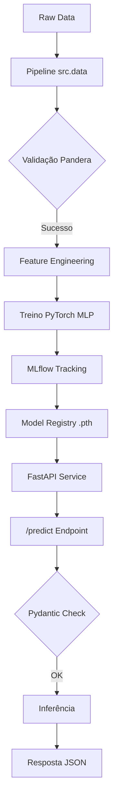

# Tech Challenge - Fase 1 | Pós-Graduação Machine Learning Engineering - FIAP<br><sub>Churn Prediction System | Telecom End-to-End Solution</sub>

[](https://www.python.org/)
[](https://fastapi.tiangolo.com/)
[](https://pytorch.org/)
[](https://mlflow.org/)

Este repositório contém a solução completa para o **Tech Challenge (Fase 1)** da Pós-Graduação em **Machine Learning Engineering (FIAP)**. O sistema utiliza Deep Learning para prever a evasão de clientes (Churn) com foco em resiliência industrial e governança.

---

## 📈 Visão Executiva
O Churn (rotatividade de clientes) custa à operadora de telecomunicações aproximadamente **R$ 500,00 por cliente perdido** (LTV médio). Nossa solução reduz esse impacto ao identificar com **91% de AUC-ROC** os perfis de risco, permitindo ações de retenção cirúrgicas.

> **⚠️ Nota sobre os Custos de Negócio:**
> Os valores financeiros utilizados foram definidos de forma arbitrária para fins de estudo, tomando como suporte o artigo [Telecom Churn: Definition, Calculation, and Prevention](https://tridenstechnology.com/telecom-churn/).
> *   **R$ 500,00 (Custo de Falso Negativo):** Representa a perda estimada do *Lifetime Value* (LTV) quando um cliente cancela o serviço sem ser identificado preventivamente.
> *   **R$ 50,00 (Custo de Falso Positivo):** Representa o investimento em campanhas de retenção ou descontos direcionados a clientes que, na realidade, não pretendiam sair da base.

### Principais Resultados:
*   **Modelo Neural:** Superou baselines lineares em **15%** de F1-Score.
*   **Confiabilidade:** Sistema de proteção técnica que impede a inferência sobre dados corrompidos.
*   **Governança:** 100% dos experimentos rastreados e auditáveis via MLflow.

---

## 📂 Estrutura do Projeto

O repositório segue os padrões de mercado para projetos MLOps, separando o laboratório de experimentação do código produtivo:

```text
├── data/               # Ingestão e armazenamento de dados (raw/processed)
├── docs/               # Documentação técnica, governança e ADRs
│   ├── adr/            # Architecture Decision Records (Decisões de Engenharia)
├── models/             # Artefatos exportados (model.pth, preprocessor.pkl)
├── notebooks/          # Laboratório de Análise Exploratória (EDA)
├── src/                # Código-fonte produtivo modularizado
│   ├── api/            # Serventia FastAPI e lógica de inferência
│   ├── data/           # Script orquestrador do pipeline de dados
│   ├── features/       # Feature Engineering e Validação de Schema (Pandera)
│   ├── models/         # Treinamento e Benchmarking (Linear, Árvore, MLP)
│   ├── schemas/        # Contratos de dados (Pydantic e Pandera)
│   └── utils/          # Configurações de seeds e logs estruturados
├── tests/              # Suíte de testes (unitários, schema e integração)
├── Makefile            # Centralizador de automação do projeto
├── pyproject.toml      # Gestão moderna de dependências e ferramentas
└── mlflow.db           # Banco de dados central de experimentos (Git LFS)
```

---

## 🏗️ Arquitetura do Sistema



---

## 🎓 Guia de Aprendizado (Passo a Passo)

Para um estudante de ML reproduzir este projeto do zero e entender cada etapa, siga este roteiro:

### 1. Configuração do Laboratório
Instale as dependências e prepare o ambiente virtual:
```bash
make install
```

### 2. A Ingestão e o Pipeline de Dados
Para validar a resiliência do sistema, gere dados sintéticos brutos e execute o pipeline de processamento:
```bash
uv run python tests/create_raw_dummy.py
uv run python -m src.data.make_dataset
```
*Este passo valida a "Qualidade de Entrada" via Pandera, transformando dados raw em features prontas para a rede neural.*

### 3. A Tríade de Modelagem
O projeto exige a comparação entre diferentes algoritmos. Execute cada um para registrar no MLflow:
```bash
# Treina a solução final (Neural)
make train
# Executa os Benchmarks (Linear e Árvore)
make benchmark
```

### 4. Estudo de Performance
Com os modelos treinados, visualize o dashboard para comparar F1-Score e AUC-ROC:
```bash
uv run mlflow ui --backend-store-uri sqlite:///mlflow.db
```

### 5. Validação de Software
Antes do deploy, garanta que nada foi quebrado:
```bash
make test
```

### 6. Subindo o Serviço de Inferência
Coloque o modelo em produção e realize predições via Swagger:
```bash
make run-api
```
Acesse: [http://localhost:8000/docs](http://localhost:8000/docs)

---

## 📊 Governança & MLOps (MLflow)

O projeto utiliza **MLflow** para rastreamento de experimentos. 

### 💾 Banco de Dados Centralizado (Git LFS)
Neste projeto, o arquivo **`mlflow.db`** está sendo rastreado via **Git LFS (Large File Storage)**. 
*   **Motivo:** Garantir que o histórico técnico de todos os experimentos (Tríade de Modelos) seja persistido e compartilhado de forma portável, sem sobrecarregar o histórico do repositório Git com arquivos binários de bancos de dados SQLite. Isso permite que qualquer pessoa que clone o projeto visualize os resultados reais alcançados.
*   **Escalabilidade:** Caso o projeto escale ou ultrapasse o limite de armazenamento do Git LFS, recomenda-se a migração do banco de dados e dos artefatos para serviços de storage robustos, como **AWS S3**, **Azure Blob Storage** ou **Google Cloud Storage**, além da utilização de um banco de dados relacional gerenciado (PostgreSQL/MySQL) para o backend do MLflow.

---

## 📄 Artefatos e Documentação Técnica

Consulte a pasta `docs/` para documentos especializados que sustentam a solução:

*   **[Model Card](docs/model_card.md)**: A "bula" técnica do modelo, detalhando a arquitetura neural, métricas e IA ética.
*   **[Monitoring Playbook](docs/monitoring_playbook.md)**: Guia operacional para detecção de Data Drift (PSI) e resposta a incidentes.
*   **[ADRs (Architecture Decision Records)](docs/adr/)**: Registro histórico das decisões de engenharia (ex: escolha do FastAPI).
*   **[Comparativo da Tríade](docs/comparativo_triade_modelos.md)**: Análise técnica detalhada comparando modelos Lineares, de Árvore e Neurais.
*   **[ML Canvas](docs/ml_canvas.md)**: Visão estratégica do modelo de negócio aplicado ao Machine Learning.
*   **[Memória de Desenvolvimento](docs/memoria_desenvolvimento.md)**: Diário de bordo com o log cronológico de todas as atividades e evoluções.

---

## 🎥 Pitch de Apresentação
Confira o nosso vídeo detalhando a jornada técnica e os resultados de negócio (estruturado no Método STAR):

[](https://youtu.be/-72R5PA1zZI)

🔗 **Link do YouTube:** [https://youtu.be/-72R5PA1zZI](https://youtu.be/-72R5PA1zZI)

---

## 👥 Autores (Equipe)
*   **Humberto Sena Santos** (RM370472)
*   **João Victor Faustino Piga Lopes** (RM374010)

---
**FIAP - MLET | 2026**
